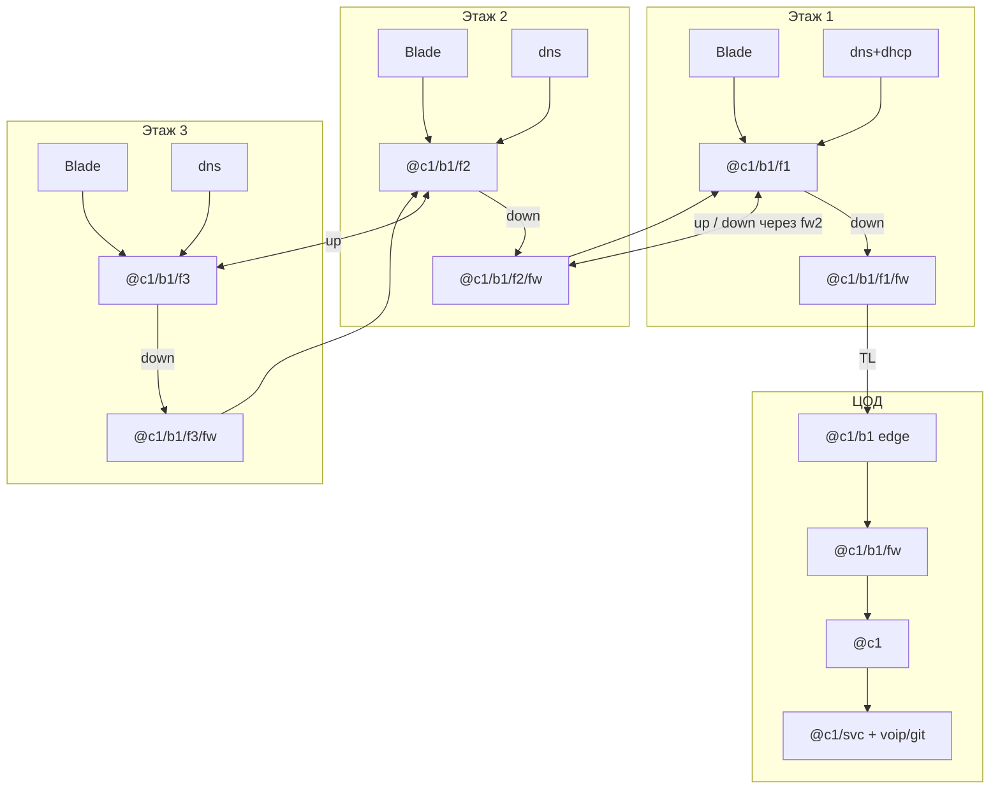
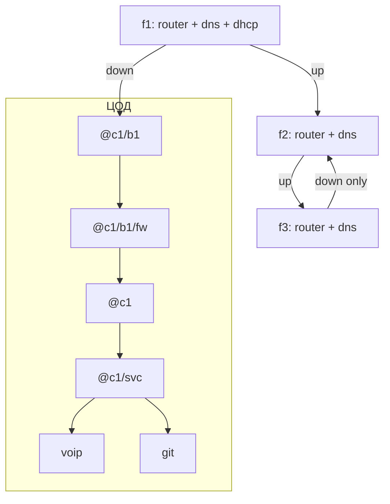

# День 1 и дальше — пошаговый гайд с нуля

Tower Networking Inc. Гайд для человека, **который никогда не играл**.  
Стартовая ситуация: **ЦОД (floor 0) + 3 этажа**.  
Схема: блоки по 3; на каждом этаже роутер + **FW на down**; в ЦОД — edge/FW/money; на **f1 блока** — DNS+DHCP; на f2/f3 — свой DNS; DHCP с f1 на весь блок.  
Пресет: без авто-DNS/авто-DHCP, **нужны сетевые адреса**, **реальная ПС**, без автозапуска программ.

Связанные файлы:

- полный справочник: [`tni-floor-connectivity.md`](./tni-floor-connectivity.md)
- только алиасы: [`alias-pack.txt`](./alias-pack.txt)

---

## Оглавление

1. [Что это за игра (30 секунд)](#что-это-за-игра-30-секунд)
2. [Как устроена сеть в двух словах](#как-устроена-сеть-в-двух-словах)
3. [Анатомия блока: цепочка этажных роутеров](#анатомия-блока-цепочка-этажных-роутеров)
4. [Имена (заучи сразу)](#имена-заучи-сразу)
5. [Цвета кабелей](#цвета-кабелей)
6. [Список покупок на старт](#список-покупок-на-старт)
7. [Порядок подключений: что к чему](#порядок-подключений-что-к-чему)
8. [ЧАСТЬ I — День 1 (пошагово)](#часть-i--день-1-пошагово)
9. [Что ещё легко забыть](#что-ещё-легко-забыть-чеклист-дырок)
10. [ЧАСТЬ II — Расширение (что зачем)](#часть-ii--расширение-что-зачем)
11. [Алиасы (скопируй в netshell)](#алиасы-скопируй-в-netshell)
12. [Чеклисты](#чеклисты)

---

## Что это за игра (30 секунд)

Ты ISP в башне. Жильцы и офисы хотят интернет и сервисы. Ты:

1. **Физически** соединяешь устройства кабелями и заказываешь **Tower Link** между этажами.  
2. **Логически** даёшь устройствам имена `@…`, прописываешь **маршруты** и **DNS**.  
3. **Зарабатываешь**, когда клиенты доходят до твоих сервисов (VOIP, Git…) или связываешь consumer↔producer.

Без кабеля — тишина. Без `@имени` (при твоём пресете) — тоже тишина. Без маршрута — пакет не знает, куда идти. Без `dns map` — жилец не найдёт `voip.none`.

---

## Как устроена сеть в двух словах

```text
Клиенты → Blade → этажный роутер
                ↕ вверх/вниз (Tower Link)
Низ блока → ЦОД: edge → FW → ядро → svc → money (VOIP/Git)
На f1 блока: DNS + DHCP всего блока
На f2/f3 блока: свой DNS (DHCP нет — берут с f1)
```

**Блок** = ~3 этажа в **цепочке этажных роутеров**. Сейчас `b1` = этажи 1–3. Этажи 4–6 = `b2` со **своими** DNS/DHCP на своём f1 — не продолжай up с этажа 3.

---

## Анатомия блока: цепочка этажных роутеров

### Идея

На **каждом** этаже блока свой роутер:

| Этаж внутри блока | Куда смотрят линки роутера |
|-------------------|----------------------------|
| **Нижний** (f1, ближе к ЦОД) | **Вниз** → в ЦОД (на edge `@c1/b1`) **и вверх** → на роутер следующего этажа |
| **Средний** (f2) | **Вниз** → этаж ниже **и вверх** → этаж выше |
| **Верхний / последний** (f3) | **Только вниз** → на этаж ниже. Вверх **не** ведём (конец блока) |

Клиенты **не** висят напрямую на Tower Link: `клиенты → Blade → этажный роутер → линк вниз/вверх`.

**Серверы и защита на этажах блока:**

| Этаж блока | DNS | DHCP | Firewall этажа |
|------------|-----|------|----------------|
| **f1** (первый / низ) | `@c1/b1/dns` | `@c1/b1/dhcp` (на весь блок) | `@c1/b1/f1/fw` — на **down** к ЦОД |
| **f2** | `@c1/b1/f2/dns` | нет | `@c1/b1/f2/fw` — на **down** к f1 |
| **f3** (последний) | `@c1/b1/f3/dns` | нет | `@c1/b1/f3/fw` — на **down** к f2 |

DHCP на f1 кормит весь блок. Money (**VOIP/Git**) — только в ЦОД.  
Этажный FW режет Morris/scraper **до** того, как зараза пойдёт вниз по цепочке; в ЦОД остаётся ещё `@c1/b1/fw` на стволе блока→ядро.



```text
ЦОД:   @c1/b1 → @c1/b1/fw → @c1 → svc → voip/git

Этаж1: Blade → router f1 ← dns + dhcp
                 │ down
              f1/fw → TL → ЦОД
                 │ up (без FW или как решишь)
              → этаж 2

Этаж2: Blade → router f2 ← dns
                 │ down
              f2/fw → TL → up-порт f1
                 │ up
              → этаж 3

Этаж3: Blade → router f3 ← dns
                 │ down only
              f3/fw → TL → up-порт f2
```

### Зачем роутер на каждом этаже

- Префикс `@c1/b1/fN` остаётся на этаже: меньше broadcast на чужих Blade.
- Цепочка: в ЦОД уходит **один** Tower Link от низа блока, а не три параллельных с каждого этажа.
- Граница блока явная: у f3 нет «вверх» → случайно не склеишь b1 с b2.
- Потом проще VLAN/FW на этаже.

### Комплект ролей

| Роль | Имя | Где физически |
|------|-----|----------------|
| Edge блока | `@c1/b1` | **ЦОД** — сюда «вниз» с этажа 1 |
| **Firewall блока** | `@c1/b1/fw` | **ЦОД**, разрыв edge → ядро |
| Money VOIP/Git | `@c1/svc/voip`, `…/git` | **ЦОД** |
| Ядро | `@c1` | **ЦОД** |
| Этажный роутер | `@c1/b1/f1`…`f3` | На своём этаже |
| **Firewall этажа** | `@c1/b1/fN/fw` | На **каждом** этаже, в разрыв **down**-линка |
| Switch | `@c1/b1/fN/s1` | На своём этаже |
| **DNS + DHCP блока** | `@c1/b1/dns`, `@c1/b1/dhcp` | **Этаж 1 блока** |
| **DNS этажа** | `@c1/b1/f2/dns`, `@c1/b1/f3/dns` | **Этажи 2 и 3** |

На каждом FW (этаж + ЦОД) хотя бы `fcmal`. **Datawiper** обязателен. Up-линк между этажами обычно **без** второго FW (фильтр на down достаточно); при паранойе можно врезать FW и на up.

### Что НЕ делать

- Вешать этаж 4 «вверх» с `@c1/b1/f3` — это уже блок `b2`, своя цепочка и свой edge.
- Ставить voip/git на этаж 1 «раз уж там DNS/DHCP».
- DHCP на каждом этаже блока — достаточно **одного** на f1.
- DNS только в ЦОД «на весь блок» и пустые этажи без DNS — ломает задумку локальных map на f2/f3.

### Упрощение «очень мало денег» (не основной путь)

Только Blade на этаже и три линка прямо в `@c1/b1` — быстрее старт, хуже ПС и границы блоков. Дальше в гайде везде **цепочка с этажными роутерами**.

---

## Имена (заучи сразу)

```text
@c1                 ядро ЦОД
@c1/b1              edge блока в ЦОД
@c1/b1/fw           firewall блока
@c1/svc             сервисный роутер money
@c1/svc/voip        VOIP (ЦОД)
@c1/svc/git         GitCoffee (ЦОД)
@c1/b1/f1           этажный роутер этажа 1
@c1/b1/f1/fw        firewall этажа 1 (на down)
@c1/b1/dns          DNS блока — на этаже 1
@c1/b1/dhcp         DHCP блока — на этаже 1
@c1/b1/f2           этажный роутер этажа 2
@c1/b1/f2/fw        firewall этажа 2 (на down)
@c1/b1/f2/dns       DNS этажа 2
@c1/b1/f3           этажный роутер этажа 3
@c1/b1/f3/fw        firewall этажа 3 (на down)
@c1/b1/f3/dns       DNS этажа 3
@c1/b1/f1/s1        switch этажа 1
@c1/b1/f1/c1        клиент
@c1/b1/f2/p1        продюсер
```

Позже: `@c1/b2/dns` + `@c1/b2/dhcp` на первом этаже b2, `@c1/b2/f2/dns`… на остальных. **Не** называй DNS просто `@dns`.

---

## Цвета кабелей

Цвет **не влияет на скорость**. Один цвет = один заказ на длину.

| Цвет | Куда |
|------|------|
| **Синий** | Клиент → Blade |
| **Зелёный** | Продюсер / телефон / камера → Blade |
| **Белый** (или серый) | Blade → **этажный роутер** (патч на этаже) |
| **Жёлтый** | Цепочка **down**: роутер → **этажный FW** → розетка riser |
| **Оранжевый** | Роутер **вверх** / ствол в ЦОД (`b1`↔`b1/fw`↔`c1`↔`svc`) |
| **Красный** | К серверам: voip/git в ЦОД; dns/dhcp/dns этажа на этажах |
| **Фиолетовый** | Debugger |

Если мало цветов: минимум синий (клиенты), белый (blade↔router), жёлтый (все вертикальные Tower Link), красный (серверы).

Длину меряй **T**.

---

## Список покупок на старт

### Железо в ЦОД

| Кол-во | Что | Имя | Зачем |
|--------|-----|-----|--------|
| 1 | Disco **Micro** | `@c1` | Ядро |
| 1 | Disco **Milli** | `@c1/b1` | Edge блока |
| 1 | **Firewall** | `@c1/b1/fw` | Разрыв b1→c1 |
| 1 | Disco **Milli** | `@c1/svc` | Перед money |
| 1 | Boulder+ | `@c1/svc/voip` | voip-server |
| 1 | Boulder+ | `@c1/svc/git` | gitcoffee |
| 1 | Debugger | `@me` | netshell |
| 1 | **Datawiper USB** | — | Сброс FW |

DNS и DHCP **не** в ЦОД — они на этаже 1 блока. Отложить: второй FW перед svc, NAS, отдельный Padu.

### Железо на этажах блока

| Этаж | Что | Имя | Зачем |
|------|-----|-----|--------|
| **каждый** | Blade5 | `@c1/b1/fN/s1` | Клиенты |
| **каждый** | Роутер | `@c1/b1/fN` | Цепочка up/down |
| **каждый** | **Firewall** | `@c1/b1/fN/fw` | В разрыв **down** |
| **f1** | Boulder+ | `@c1/b1/dns` | DNS блока |
| **f1** | Boulder+ | `@c1/b1/dhcp` | DHCP на весь блок |
| **f2** | Boulder / Boulder+ | `@c1/b1/f2/dns` | DNS этажа |
| **f3** | Boulder / Boulder+ | `@c1/b1/f3/dns` | DNS этажа |
| f3 | — | — | без DHCP и без up |

Итого FW: **1 в ЦОД** + **1 на каждый этаж блока** (на старте 1+3). Питание на Blade, роутер, FW и серверы. На f3 не покупай вертикаль «вверх».

### Кабели (ориентир)

| Цвет | Длина | Куда |
|------|-------|------|
| Оранжевый | 200 | ЦОД: b1↔fw↔c1↔svc; этажи: **up** f1→f2, f2→f3 |
| Жёлтый | 500–2000 | **down**: роутер → **этажный FW** → riser (f1→ЦОД, f2→f1, f3→f2) |
| Красный | 200–500 | ЦОД: voip/git; **этаж 1:** dns+dhcp к роутеру f1; **f2/f3:** dns к роутеру этажа |
| Белый | 200–500 | Blade → этажный роутер |
| Синий / зелёный | по T | клиенты / phone |
| Фиолетовый | 1000–1500 | debugger |

### Программы (что ставить)

| Программа | Куда | Зачем | Когда |
|-----------|------|-------|--------|
| `dns-server` | `@c1/b1/dns` **и** `@c1/b1/f2/dns`, `@c1/b1/f3/dns` | Резолв | **День 1** |
| `dnsmasq` или `kea` | `@c1/b1/dhcp` (только f1) | Адреса всего блока | **День 1** (пресет без auto-DHCP) |
| `voip-server` | `@c1/svc/voip` | STREAM-VOICE | День 1 |
| `gitcoffee` | `@c1/svc/git` | UPDATE-SOFTWARE | День 1 |
| `padu_v1` | на git и/или отдельный | Store | День 1–2 |

На каждом DNS (f1/f2/f3) одни и те же money-map (`voip.none`, `git.none`); локальных продюсеров map’ь на DNS того этажа (или на `@c1/b1/dns`). Автозапуска нет — проверяй `watch`.

### Приложения на телефоне (Rocket Store)

| Приложение | Зачем |
|------------|--------|
| **Tower Link** | Обычно уже есть — связь этаж↔ЦОД |
| **The Registry** | Домены voip.none / git.none + PPU |
| **Surveyor** | Кто producer/consumer, когда онлайн |
| **Socketeer** (~500$) | Лишние розетки в ЦОД — удобно, не обязательно в час 1 |

---

## Порядок подключений: что к чему

Схема дня 1: **цепочка этажных роутеров** + money/FW в ЦОД + **DNS/DHCP на f1**, DNS на f2/f3. Номера портов — пример; **запиши свои**.

### Общая картина



Вертикальные линки = кабель в розетку + **Tower Link** в телефоне.  
FW стоит **на пути** пакетов (кабель через него), не «рядом для красоты».

---

### ЦОД — порядок патчинга

#### 0. Питание

`@c1`, `@c1/b1`, `@c1/b1/fw`, `@c1/svc`, voip, git → розетки ЦОД.  
(DNS/DHCP питаются **на этаже 1**.)

#### 1. Ствол с firewall (оранжевый ~200)

| # | От | Port | К | Port |
|---|----|------|---|------|
| 1 | `@c1/b1` | **7** | `@c1/b1/fw` | **0** (вход со стороны блока) |
| 2 | `@c1/b1/fw` | **1** | `@c1` | **0** (выход к ядру) |
| 3 | `@c1` | **1** | `@c1/svc` | **7** |

```text
@c1/b1 port7 ===== FW ===== @c1 port0 / port1 ===== @c1/svc port7
                 (в разрыве)
```

Магазинный FW ведёт себя как «фильтрующий switch»: отдельные `route` на нём обычно не нужны. Важно только: трафик **реально проходит** через него.

#### 2. Money-серверы (красный)

| # | От `@c1/svc` | К |
|---|--------------|---|
| 4 | port**0** | `@c1/svc/voip` |
| 5 | port**1** | `@c1/svc/git` |

(DNS больше не в ЦОД.)

#### 3. Одна розетка под ствол блока (не три!)

| # | Розетка ЦОД | К | Port edge |
|---|-------------|---|-----------|
| 6 | под линк с этажа 1 | `@c1/b1` | **0** |

#### 4. Debugger

Фиолетовый → свободный порт `@c1` (не 0/1). Пока крутишь FW — debugger лучше **за** FW (со стороны ядра).

#### Схема портов ЦОД (заполни)

```text
@c1/b1      0   ← TL down с @c1/b1/f1     serial ____
@c1/b1      7   → оранжевый → FW port0
@c1/b1/fw   0   ← от b1
@c1/b1/fw   1   → оранжевый → @c1 port0
@c1         0   ← от FW
@c1         1   → @c1/svc port7
@c1/svc     7   ← @c1
@c1/svc     0/1 → voip / git
```

---

### Этаж — общий шаблон (локаль одинакова)

| # | Действие | От | К | Цвет |
|---|----------|----|---|------|
| 1 | Питание | розетка | Blade, роутер, **FW**, серверы | питание |
| 2 | Клиенты | consumer | Blade | синий |
| 3 | Phone / cam / producer | устройство | Blade | зелёный |
| 4 | Агрегация | Blade | роутер portL | **белый** |
| 5 | Down через FW | роутер portD | **FW port0** | жёлтый короткий |
| 6 | Down в riser | **FW port1** | розетка «вниз» | **жёлтый** |
| 7 | Up (не на последнем этаже) | роутер portU | розетка «вверх» | **оранжевый** |
| 8 | Tower Link | serial down/up | парная розетка | — |

```text
Клиенты/phone ──→ Blade ──белый──→ Роутер
                                    │
                         portD ──→ FW ──→ розетка DOWN → TL
                         portU ──→ розетка UP → TL   (нет на f3)
```

Ниже — **отдельные схемы** для первого этажа блока и для остальных.

---

### Схема: первый этаж блока (f1)

DNS + DHCP блока · down в ЦОД через `f1/fw` · up на f2.

```text
                    ┌──────────────────────────────────────┐
                    │               ЭТАЖ 1                 │
  клиенты ─синий─┐  │                                      │
  phone ─зелён.──┼──┤→ Blade5 ──белый──→ @c1/b1/f1          │
  producer ──────┘  │               │                      │
                    │          port2├──красный──→ @c1/b1/dns│
                    │          port3├──красный──→ @c1/b1/dhcp│
                    │          port0│ ← Blade                │
                    │          port1├──оранжевый──→ розетка UP → f2
                    │          port7├──жёлтый──→ f1/fw port0 │
                    │               │                      │
                    │          @c1/b1/f1/fw                 │
                    │            port1 ──жёлтый──→ розетка DOWN
                    └───────────────┼──────────────────────┘
                                    │ Tower Link
                                    ▼
                             ЦОД @c1/b1 port0
```

| Порт | Куда |
|------|------|
| f1 port0 | Blade |
| f1 port1 | UP → этаж 2 |
| f1 port2 | `@c1/b1/dns` |
| f1 port3 | `@c1/b1/dhcp` |
| f1 port7 → f1/fw → DOWN | TL → `@c1/b1` в ЦОД |

```text
ncall @c1/b1/f1/fw @c1/b1/dns FW1_HW
fcmal @c1/b1/f1/fw
rca @c1/b1/f1/s1 0 @c1/b1/f1
rca @c1/b1/dns 2 @c1/b1/f1
rca @c1/b1/dhcp 3 @c1/b1/f1
rcat udp/67 3 @c1/b1/f1
rcb @c1/b1/f1
rca @c1/b1/f2 1 @c1/b1/f1
rcd 7 @c1/b1/f1
pidns2 @c1/b1/dns
pidhcp1 @c1/b1/dhcp
dhprefix @c1/b1/ @c1/b1/dhcp
dhdns @c1/b1/dns @c1/b1/dhcp
```

На edge в ЦОД: `rca @c1/b1/f1 0 @c1/b1`.  
`udp/67` с f2/f3 должен доходить до dhcp на f1 (`rcat udp/67` вниз на каждом этаже).

---

### Схема: остальные этажи блока (f2 — середина)

Свой DNS · **без** DHCP · down через `f2/fw` на f1 · up на f3.

```text
                    ┌──────────────────────────────────────┐
                    │               ЭТАЖ 2                 │
  клиенты ──────────┤→ Blade ──белый──→ @c1/b1/f2           │
                    │               │                      │
                    │          port2├──красный──→ @c1/b1/f2/dns
                    │          port0│ ← Blade                │
                    │          port1├──оранжевый──→ UP → f3  │
                    │          port7├──жёлтый──→ f2/fw       │
                    │          f2/fw ──→ DOWN → TL → UP f1   │
                    └──────────────────────────────────────┘
```

```text
ncall @c1/b1/f2/fw @c1/b1/f2/dns FW2_HW
fcmal @c1/b1/f2/fw
rca @c1/b1/f2/s1 0 @c1/b1/f2
rca @c1/b1/f2/dns 2 @c1/b1/f2
rca @c1/b1/f3 1 @c1/b1/f2
rcat udp/67 7 @c1/b1/f2
rcd 7 @c1/b1/f2
pidns2 @c1/b1/f2/dns
dmap voip.none @c1/svc/voip @c1/b1/f2/dns
dmap git.none @c1/svc/git @c1/b1/f2/dns
```

---

### Схема: последний этаж блока (f3)

Как f2, но **нет UP** и нет DHCP.

```text
                    ┌──────────────────────────────────────┐
                    │        ЭТАЖ 3 (конец блока)          │
  клиенты ──────────┤→ Blade ──белый──→ @c1/b1/f3           │
                    │          port2 ──→ @c1/b1/f3/dns       │
                    │          port7 ──→ f3/fw ──→ DOWN → f2 │
                    │          UP: нет                       │
                    └──────────────────────────────────────┘
```

```text
ncall @c1/b1/f3/fw @c1/b1/f3/dns FW3_HW
fcmal @c1/b1/f3/fw
rca @c1/b1/f3/s1 0 @c1/b1/f3
rca @c1/b1/f3/dns 2 @c1/b1/f3
rcat udp/67 7 @c1/b1/f3
rcd 7 @c1/b1/f3
pidns2 @c1/b1/f3/dns
dmap voip.none @c1/svc/voip @c1/b1/f3/dns
dmap git.none @c1/svc/git @c1/b1/f3/dns
```

Не линкуй f3 → этаж 4: блок `b2` со своим первым этажом (dns+dhcp+fw).

---

### Таблица Tower Link блока b1

| Линк | From | To | Зачем |
|------|------|----|-------|
| A | floor 0, serial к `@c1/b1` | floor 1, serial **после** `f1/fw` (DOWN) | ствол в ЦОД |
| B | floor 1 UP | floor 2 DOWN (после `f2/fw`) | вверх/вниз |
| C | floor 2 UP | floor 3 DOWN (после `f3/fw`) | вверх/вниз |
| — | этаж 3 вверх | — | **не создавать** |

Старт — **cat1**.

---

### Чего не делать

| Ошибка | Почему |
|--------|--------|
| Этажный FW мимо down | Вирус этажа уходит вниз без фильтра |
| Только ЦОД-FW | Зараза гуляет по цепочке этажей |
| Три линка этаж→ЦОД | Ломает блок |
| Up с f3 на этаж 4 | Склеишь b1 и b2 |
| DHCP на f2/f3 | DHCP только на f1 |
| Whitelist без tcp/23 | Datawiper |

---

### Мини-чеклист патчинга

**ЦОД**

- [ ] c1, b1, **b1/fw**, svc, voip, git  
- [ ] b1 → b1/fw → c1 → svc  
- [ ] `fcmal @c1/b1/fw` · Datawiper  

**Этаж 1**

- [ ] Blade + router + **f1/fw** + dns + dhcp  
- [ ] down: router → fw → ЦОД; up → f2  
- [ ] `fcmal @c1/b1/f1/fw`  

**Этажи 2–3**

- [ ] Blade + router + **fN/fw** + dns  
- [ ] down через fw; на f2 есть up; на f3 up нет  
- [ ] `fcmal` на каждом этажном FW  
- [ ] Link lights A/B/C  

---

# ЧАСТЬ I — День 1 (пошагово)

Делай строго по порядку. Не прыгай к DNS, пока не горят линки.

## Шаг 0. Осмотрись

1. Ты в **ЦОД (floor 0)** — стойки, розетки сети и питания.  
2. На телефоне открой **Surveyor** — посмотри этажи 1–3: кто consumer, кто producer, часы активности.  
3. Запиши в блокнот (или clipboard игры) serial’ы розеток riser, которые будешь использовать.

## Шаг 1. Расставь железо в ЦОД и запатчь по схеме

1. Micro → `@c1`, Milli → `@c1/b1`, **FW** → `@c1/b1/fw`, Milli → `@c1/svc`, Boulder+ ×2 → voip/git.  
2. Питание. Оранжевый: `b1` → `fw` → `c1` → `svc`. Красный: svc → voip/git.  
3. Одна розетка ЦОД → `b1 port0`. Debugger в `@c1`. Datawiper в инвентаре.  

DNS/DHCP и этажные роутеры — на этажах (шаг 7–8).

## Шаг 2. Открой netshell и заведи алиасы

1. Debugger в сети → открой терминал / netshell.  
2. Узнай hardware id debugger’а (число на устройстве / в UI).  
3. Выполни (подставь число):

```text
always using 12345
```

или после создания алиасов: `setdbg 12345`.

4. Скопируй блок **«Старт: обязательные алиасы»** из [конца файла](#алиасы-скопируй-в-netshell) (или весь [`alias-pack.txt`](./alias-pack.txt)).

## Шаг 3. Имена устройств в ЦОД

Пока DNS этажа 1 ещё не поднят — можно временно указать любой будущий DNS или сначала поднять этаж 1 (шаг 7), потом вернуться. Удобный порядок: **сначала этаж 1 (DNS+DHCP)**, потом имена ЦОД на `@c1/b1/dns`.

```text
ncall @c1 @c1/b1/dns HARDWARE_ID_ЯДРА
ncall @c1/b1 @c1/b1/dns HARDWARE_ID_EDGE
ncall @c1/b1/fw @c1/b1/dns HARDWARE_ID_FW
ncall @c1/svc @c1/b1/dns HARDWARE_ID_SVC
ncall @c1/svc/voip @c1/b1/dns HARDWARE_ID_VOIP
ncall @c1/svc/git @c1/b1/dns HARDWARE_ID_GIT
```

## Шаг 4. Программы money в ЦОД

```text
pivoip @c1/svc/voip
pigitc @c1/svc/git
pip1 @c1/svc/git
```

DNS/DHCP ставятся на этажах (шаг 7–8). Автозапуска нет — `watch`.

## Шаг 5. Маршруты в ЦОД

```text
rca @c1/b1 0 @c1
rca @c1/svc 1 @c1
rca @c1 7 @c1/b1
rcd 7 @c1/b1
rca @c1 7 @c1/svc
rcd 7 @c1/svc
rca @c1/svc/voip 0 @c1/svc
rca @c1/svc/git 1 @c1/svc
```

После линка с этажа 1: `rca @c1/b1/f1 0 @c1/b1`.

## Шаг 5b. Firewall против Morris (не откладывай на неделю)

Железо уже в разрыве b1→c1. Без правил FW ≈ прозрачный — **вирус проходит**.

1. Имя уже есть: `ncall @c1/b1/fw …` (шаг 3).  
2. **Сначала мягкий режим** (default allow + deny мусора) — почти не ломает выручку:

```text
fcmal @c1/b1/fw
fsh @c1/b1/fw
```

Режет scraper `tcp/8034` и Morris `tcp/510–519`.

3. Когда `ping`/`trace`/деньги стабильны — можно ужесточить whitelist:

```text
fcsafe @c1/b1/fw
```

или `fcall` (то же по сути). **tcp/23 всегда первым в allow**, иначе Datawiper.

4. Проверка после правил: `ping @c1/b1/f1` с ядра, `trc @c1/svc/voip from @c1/b1/f1/c1`, управление netshell на FW живо.

5. Если отрезал себя → Datawiper USB на FW = factory reset → снова с `fcmal`.

Костыль без железа FW (хуже): blackhole на edge `rcbh tcp/8034 EMPTY_PORT @c1/b1` (+ пачка на 510–519) — не замена нормальному FW.

Позже: второй FW перед `@c1/svc` тем же рецептом.

## Шаг 6. Registry (деньги)

1. Rocket Store → **The Registry**.  
2. Домен `voip.none` → usage **STREAM-VOICE** → PPU **~1.1**.  
3. Домен `git.none` → usage **UPDATE-SOFTWARE** → PPU **~1.1**.  
4. В netshell на **каждом** DNS этажа:

```text
dmap voip.none @c1/svc/voip @c1/b1/dns
dmap git.none @c1/svc/git @c1/b1/dns
dmap voip.none @c1/svc/voip @c1/b1/f2/dns
dmap git.none @c1/svc/git @c1/b1/f2/dns
dmap voip.none @c1/svc/voip @c1/b1/f3/dns
dmap git.none @c1/svc/git @c1/b1/f3/dns
```

(Если DNS f2/f3 ещё не подняты — map после шага 8.)

Без этого шага (авто-DNS выкл) домен в Registry пустой.

## Шаг 7. Этаж 1 — роутер + FW + DNS + DHCP

Полная схема: [первый этаж блока](#схема-первый-этаж-блока-f1).

1. Blade + `@c1/b1/f1` + **`@c1/b1/f1/fw`** + dns + dhcp, питание.  
2. Клиенты → Blade → роутер; красный → dns/dhcp.  
3. Down: роутер → **f1/fw** → розетка → TL в ЦОД; up → f2.  
4. Имена / программы / `fcmal`:

```text
ncall @c1/b1/f1 @c1/b1/dns ROUTER_HW
ncall @c1/b1/f1/fw @c1/b1/dns FW1_HW
ncall @c1/b1/dns @c1/b1/dns DNS_HW
ncall @c1/b1/dhcp @c1/b1/dns DHCP_HW
ncall @c1/b1/f1/s1 @c1/b1/dns SWITCH_HW
fcmal @c1/b1/f1/fw
pidns2 @c1/b1/dns
pidhcp1 @c1/b1/dhcp
dhprefix @c1/b1/ @c1/b1/dhcp
dhdns @c1/b1/dns @c1/b1/dhcp
```

5. Маршруты — как в схеме f1.  
6. `dmap` money на `@c1/b1/dns`.  
7. `ping @c1/b1/dns` · `dhs @c1/b1/dhcp` · `fsh @c1/b1/f1/fw`.

## Шаг 8. Этажи 2 и 3 — роутер + FW + DNS (без DHCP)

Схемы: [f2](#схема-остальные-этажи-блока-f2--середина), [f3](#схема-последний-этаж-блока-f3).

**Этаж 2:** Blade + f2 + **f2/fw** + f2/dns; down через fw на f1; up на f3.

```text
ncall @c1/b1/f2 @c1/b1/f2/dns R2_HW
ncall @c1/b1/f2/fw @c1/b1/f2/dns FW2_HW
ncall @c1/b1/f2/dns @c1/b1/f2/dns DNS2_HW
fcmal @c1/b1/f2/fw
pidns2 @c1/b1/f2/dns
dmap voip.none @c1/svc/voip @c1/b1/f2/dns
dmap git.none @c1/svc/git @c1/b1/f2/dns
rcat udp/67 7 @c1/b1/f2
```

**Этаж 3:** то же + **f3/fw**, только down, без DHCP и без up.

Клиенты f2/f3: адрес с DHCP f1; DNS — option `@c1/b1/dns` или `ncall` на `@c1/b1/fN/dns`.

## Шаг 9. Телефон (VOIP-выручка)

1. Телефон → Blade (зелёный) → уже в этажном роутере.  
2. `ncall @c1/b1/f2/phone @c1/b1/dns HW`.  
3. Traffic к VOIP вверх по цепочке / default:

```text
rcat udp/5060 7 @c1/b1/f2
rcat udp/5060 7 @c1/b1/f1
rcat udp/5060 0 @c1/b1
rcat udp/5060 PORT_VOIP @c1/svc
```

(или опирайся на default down, если он уже ведёт в ЦОД — проверь `trace`.)  
4. `watch @c1/svc/voip`.

## Шаг 10. День 1 готов, если

- [ ] В ЦОД: edge + **b1/fw** + svc + voip/git  
- [ ] На **f1**: роутер + **f1/fw** + DNS + DHCP  
- [ ] На **f2/f3**: роутер + **fN/fw** + DNS  
- [ ] `fcmal` на ЦОД-FW и на **каждом** этажном FW  
- [ ] TL: ЦОД↔f1, f1↔f2, f2↔f3; у f3 нет up  
- [ ] `udp/67` до DHCP на f1  
- [ ] `dmap` на всех DNS  
- [ ] `ping` / `trace` до voip  

**Не делай:** up f3→4; FW мимо down; DHCP на f2/f3; whitelist без tcp/23.

---

## Что ещё легко забыть (чеклист «дырок»)

| Тема | Зачем | Когда |
|------|-------|--------|
| **Firewall на каждом этаже** | В разрыв **down**; плюс FW блока в ЦОД | День 1 |
| **Firewall + Datawiper** | Morris/scraper; иначе жрут ПС | День 1 |
| **Автозапуск программ выкл** | После `program install` проверь `watch` / список — сервис может «лежать» | После install |
| **DHCP только на f1** | На f2/f3 DHCP не дублировать; `udp/67` тянуть к f1 | День 1 |
| **DNS на каждом этаже блока** | f1 = блок DNS; f2/f3 = свой dns-server + те же money map | День 1 |
| **Публичный телефон** | Без него Accept-VOIP часто не капает | Шаг 9 |
| **Карта продюсера в DNS** | Surveyor → имя → `dmap` на `@…/p1` | Когда producer онлайн |
| **Запись портов/serial/цветов** | Авария / замена железа без фото = ад | С первого патча |
| **Питание этажа (лимит)** | На жилых этажах бывает лимит Вт — Secretariat снимает; ЦОД обычно без лимита | Если «не хватает мощности» |
| **Счёт за электричество** | Бесплатного света нет — не плоди железо «на склад» включённым | Всегда |
| **View Links / cat** | 100% traversals → апгрейд cat (краткий outage) | Как только краснеет |
| **Warranty** | После гарантии железо дохнет вместе с routes/FW | Документируй; ASAP Remote Backups |
| **Не втыкать заражённое в чистое ядро** | Сначала отрежь uplink блока, чисти снизу вверх | При Morris |
| **Чистка Morris** | Сервер: `program uninstall`; роутер: `sftp rm` (`morrt`) — нужен sftp | После unlock бэкапов |
| **Камеры udp/554** | Как телефон: зелёный патч + `rcat udp/554` к CCTV/серверу | Если есть cam usage |
| **Socketeer** | Мало розеток в ЦОД под FW/NAS/второй блок | По мере спагетти |
| **Свободный порт под второй FW / NAS** | Не забить все порты `@c1` в день 1 | Раскладка стоек |
| **Этаж-4 ≠ up с f3** | Новый блок `b2`, своя цепочка | Рост башни |
| **Blackhole scraper** | Временная защита, если FW ещё нет | `rcbh` на edge |
| **Алиасы в userdata** | Потеряются при смене ПК/профиля — бэкапь `settings.json` | После набора алиасов |

---

# ЧАСТЬ II — Расширение (что зачем)

Ниже — **по пунктам**: зачем нужно → когда брать → что купить → как настроить → алиасы.  
Деньги и **базовый FW (`fcmal`)** — в части I. Дальше: жёсткий whitelist, бэкапы, DHCP, рост.

## Обзор приоритетов

| Порядок | Тема | Зачем | Unlock / цена (ориентир) |
|---------|------|-------|---------------------------|
| 0 | **FW блока (`fcmal`)** | Morris — уже в дне 1 | Железо FW + Datawiper |
| 1 | Блок b2 | Своя цепочка + DNS/DHCP на своём f1 | Магазин |
| 2 | FW whitelist / FW перед svc | Жёстче политика | `fcsafe` / второй FW |
| 3 | Тонкая настройка DHCP binds | Продюсеры всегда с тем же `@` | уже на f1 |
| 4 | **Remote Backups** (`sftp`) | Конфиги после warranty | Secretariat **~450$** |
| 5 | **Jailbreaker** | Достать ПО с железа (FW→сервер и т.п.) | Secretariat **~1000$** (часто нужен sftp) |
| 6 | Socketeer | Розетки где удобно | Rocket Store **~500$** |
| 7 | VLAN | Разделить phone/cam/клиентов на одном uplink | Managed switch |
| 8 | RIP | Не писать mid-hop routes руками | Secretariat **~1500$** |
| 9 | Padu / больше money | Больше usage | padu_v1/v2/v3 |
| 10 | Второй ЦОД | Место + короче путь наверх | New Data Center (**+10% admin**) |
| 11 | Cablers Union | Дешевле кабели / makers | Secretariat |
| 12 | VM / HA / NetOps | Поздняя оптимизация | Research proposals |

---

## 1. Новый блок `b2` (этажи 4–6)

### Зачем
Один edge на 6+ этажей = перегруз ПС и единая точка отказа. Блок изолирует сбой: умер `b2` — `b1` и money живы.

### Почему может потребоваться
Появились этажи 4+. View Links краснеет. Клиенты тормозят.

### Куда ставить серверы блока b2

| Роль | Где |
|------|-----|
| Edge `@c1/b2` + FW | ЦОД (или хаб) |
| **DNS + DHCP** | **Первый этаж b2** (башня 4): `@c1/b2/dns`, `@c1/b2/dhcp` |
| DNS | Этажи 5 и 6: `@c1/b2/f2/dns`, `@c1/b2/f3/dns` |
| Money | Остаётся `@c1/svc` |

Не линкуй up с `@c1/b1/f3` на этаж 4.

### Что купить
- Milli `@c1/b2` + FW  
- На этаже 4: роутер + Blade + DNS + DHCP  
- На 5 и 6: роутер + Blade + DNS  
- Цепочка TL + ствол в ЦОД  

### Настройка

```text
ncall @c1/b2 @c1/b2/dns EDGE_HW
rca @c1/b2 PORT @c1
rca @c1/b2/f1 0 @c1/b2
dhprefix @c1/b2/ @c1/b2/dhcp
dhdns @c1/b2/dns @c1/b2/dhcp
dmap voip.none @c1/svc/voip @c1/b2/dns
```

Дальше — цепочка f1↔f2↔f3 внутри b2; DHCP только на f1.

---

## 2. Firewall (углубление)

Базовый `@c1/b1/fw` + `fcmal` уже в **части I**. Здесь — ужесточение и второй контур.

### Зачем ещё
Whitelist вместо «всё кроме Morris»; отдельный FW перед money, чтобы заражённый блок не стучался в voip/git лишним.

### Что купить
Второй FW → `@c1/svc/fw` в разрыв `c1` → `svc` (или `svc` → серверы). Datawiper уже должен быть.

### Настройка
На блочном FW, когда стабильно: `fcsafe @c1/b1/fw`.  
На money: `fcsafe @c1/svc/fw` или `fcall`.  
Клон правил после sftp: `cpfw @c1/b1/fw @c1/svc/fw`.

Симптомы Morris: роутер «тупит», ПС проседает, в `program list` / `sftp ls` появляется morris. **Отрежь uplink блока** от ядра → чисти → только потом возвращай линк.

---

## 3. DHCP в блоке (уже на f1 — тонкости)

### Зачем
Один DHCP на **первом этаже блока** кормит все три этажа. На f2/f3 DHCP **не** ставь.

### Настройка (напоминание)

```text
pidhcp1 @c1/b1/dhcp
dhprefix @c1/b1/ @c1/b1/dhcp
dhdns @c1/b1/dns @c1/b1/dhcp
dhbind PRODUCER_HW @c1/b1/f2/p1 @c1/b1/dhcp
rcat udp/67 3 @c1/b1/f1
rcat udp/67 7 @c1/b1/f2
rcat udp/67 7 @c1/b1/f3
rcb @c1/b1/f1
```

Авто-DNS доменов Registry **всё равно нет** — `dmap` руками на `@c1/b1/dns` и на DNS f2/f3.  
Если клиенту этажа 2 нужен именно `@c1/b1/f2/dns`: `ncall` / bind с этим DNS, либо второй dns option если билд умеет.

---

## 4. Remote Backups (`sftp`) — обязательно для долгой башни

### Зачем
После **warranty** железо дохнет. Routes, firewall rules, программы живут на устройстве. Без бэкапа = настройка с нуля.

### Почему может потребоваться
Любой edge/ядро/DNS с конфигом. Особенно после первого «умер роутер».

### Unlock
Secretariat → **Remote Backups** (~450$, «3-2-1 let's back it up!») → команда `sftp`.

### Что купить
Устройство со **свободным storage** (NAS / запасной Boulder) → `@nas`.

### Настройка

```text
sfls @c1/b1
bkroutes @c1/b1 @nas
bkfw @c1/b1/fw @nas
```

Восстановление: `sftp cp` **с NAS на** новое железо с тем же `@`, потом те же кабели/порты.

Когда откроют **cron** + `try`:

```text
crdr routes @c1/b1 @nas
crping @c1
```

---

## 5. Jailbreaker (не забудь)

### Зачем
**Достать программы/прошивки с железа** и поставить на другое устройство. Примеры из сообщества:

- скопировать firewall-софт на обычный сервер (software-firewall);  
- переносить бинарники/конфиги между коробками вместе с sftp;  
- гибче кастомить, чем «только магазинный FW».

Без Jailbreak’а sftp часто копирует конфиги, но **извлекать и ставить «железные» программы** куда угодно — ограничено.

### Почему может потребоваться
Хочешь FW-логику на сервере; мало слотов под железные firewall; эксперименты с routing-firewall; копирование ПО после аварии.

### Unlock
Secretariat → **Jailbreaker** (~1000$, «Hardware Liberation Day»).  
В гайдах часто пишут: **сначала Remote Backups / sftp**, потом Jailbreak (или оба).

### Как пользоваться (общая схема)

1. Unlock Jailbreaker + рабочий `sftp`.  
2. `sftp ls on @firewall` — смотри `/bin/`, конфиги (`/etc/nftables.conf` и т.п.).  
3. Копируй нужные файлы на сервер с storage.  
4. На целевом устройстве — install/запуск по man текущей сборки (интерфейс ещё развивается).  
5. Не забудь allow’ы и tcp/23, если крутишь FW-правила на новом хосте.

```text
sfls @c1/b1/fw
sfcp /etc/nftables.conf @c1/b1/fw @nas /backups/fw/nftables.conf
cpfw @c1/b1/fw @spare_fw
```

Точные пути бинарников смотри `sftp ls` и `man` у себя — сборки отличаются.

### Связка sftp + Jailbreak + Morris

Чистка роутера после Morris часто: `sftp rm /bin/morris…` (`morrt`). Без sftp — боль. Jailbreak расширяет, что можно снимать/переносить с железа.

---

## 6. GitCoffee + Padu (money глубже)

### Зачем
`git.none` (UPDATE-SOFTWARE) + Padu (Store-Text и связки) — стабильный доход наряду с VOIP.

### Почему может потребоваться
Только VOIP мало; Surveyor показывает спрос на updates/store.

### Настройка

```text
pigitc @c1/svc/git
pip1 @c1/svc/git
pip1 @c1/svc/padu
dmap git.none @c1/svc/git @c1/b1/dns
rcat tcp/443 PORT_GIT @c1/svc
rcat tcp/80 PORT_PADU @c1/svc
```

Registry: git → UPDATE-SOFTWARE PPU ~1.1; store-домены → Store-Text ~1.1.  
Позже Secretariat: padu_v2/v3, poems-db.

---

## 7. Socketeer

### Зачем
Дополнительные **розетки** copper/fiber/power в мире — не тянуть кабель через весь ЦОД.

### Почему
Закончились порты на стене; второй ряд стоек; новый ЦОД.

### Как
Rocket Store → Socketeer (~500$) → place socket → pay. Remove — тоже платно.

---

## 8. VLAN

### Зачем
При **конечной ПС** switch ≈ хаб: телефоны, камеры и клиенты мешают друг другу. VLAN режет broadcast-домены на одном физическом uplink’е.

### Почему может потребоваться
Uplink этажа забит; udp/5060 и udp/554 тонут в клиентском шуме; хочешь phone «ближе» к VOIP.

### Что купить
Managed switch с VLAN (Blade12/15/88… — смотри фичи). Иногда VLAN-роутер (router-on-a-stick).

### Настройка (идея)

```text
vshow @c1/b1/f1/s1
vtag1 2 10 @c1/b1/f1/s1
vlan tag port0 with #10 #20 on @c1/b1/f1/s1
```

На роутере — subinterface `port0.1` с тем же tag и `rca` на префикс VLAN.  
Новичку: **сначала блоки без VLAN**; VLAN — когда упёрся в ПС.

---

## 9. RIP

### Зачем
Автораздача маршрутов между роутерами. Ты пишешь только endpoint’ы; середина подхватывается.

### Unlock
Secretariat → Route Discovery / RIP (~1500$).

```text
ripup @c1
ripup @c1/b1
ripup @c1/svc
ripsh @c1
```

Endpoint’ы (`rca` на voip/git) всё равно нужны.

---

## 10. Второй ЦОД

### Зачем
Место под стойки; edge верхних блоков ближе к этажам; разгрузка линков в подвал.

### Unlock
**New Data Center** — бесплатно, но **admin fees +10%**.

### Как
Ядро `@c2`, блоки `@c2/b1…`, Tower Link c2↔c1, money оставь на `@c1/svc`. Подробно: [`tni-floor-connectivity.md`](./tni-floor-connectivity.md) → «Несколько ЦОД».

---

## 11. Tower Link апгрейд / ПС

### Зачем
cat1 ≈ 15 traversals/tick. Много этажей → 100% в View Links.

### Как
View Links → Manage → deactivate → upgrade (cat5 / fiber…) → reactivate. Краткий outage.  
Лечение роста: блоки + толще ствол + второй ЦОД, не «все на один Blade».

---

## 12. Прочее (кратко)

| Тема | Зачем | Когда |
|------|-------|--------|
| **Cablers Union** | −30% кабели, потом cable makers | Много закупок Ethernet |
| **Power Management** | Счета за свет, wake/suspend NAS | После Remote Backups / cron |
| **VM Research** | Несколько ролей на одном сервере | Мало места в стойке |
| **HA Research** | Отказоустойчивость роутеров | Поздняя игра |
| **pcap / tap** | Диагностика перегруза | Красные линки без причины |
| **Blackhole route** | Глушить scraper без FW | Быстрый костыль: `rcbh tcp/8034 EMPTY_PORT @edge` |
| **Decentro** | crypto tcp/8333 | Отдельный money-stream |
| **Botnet / UBBT** | Подмена/раздувание трафика | Поздний/опциональный контент |

---

# Алиасы (скопируй в netshell)

Создание: вставь строку целиком. Удаление: `alias имя`.  
Полный пак: [`alias-pack.txt`](./alias-pack.txt).

## Старт: обязательные алиасы

```text
alias setdbg echo usage: setdbg DEBUGGER_ADDR; always using $1
alias ncall echo usage: ncall NETADDR DNS_ADDR DEVICE; net address set $1 on $3; net dns set $2 on $3; net dhcp disable on $3
alias nca echo usage: nca NETADDR DEVICE; net address set $1 on $2
alias rsh echo usage: rsh ROUTER; route show on $1
alias rca echo usage: rca DEST_OR_PREFIX PORTNUM ROUTER; route add $1 via port$2 on $3
alias rcat echo usage: rcat TRAFFIC PORTNUM ROUTER; route add traffic $1 via port$2 on $3
alias rcd echo usage: rcd PORTNUM ROUTER; route default via port$1 on $2
alias rcb echo usage: rcb ROUTER; route enable broadcast on $1
alias dmap echo usage: dmap DOMAIN TARGET DNS; dns map $1 as $2 on $3
alias dsh echo usage: dsh DNS; dns show on $1
alias pdev echo usage: pdev ADDR; ping $1
alias trc echo usage: trc DEST from SRC; trace $1 from $2
alias wdev echo usage: wdev ADDR; watch $1
alias pidns2 echo usage: pidns2 SERVER; program install dns-server on $1
alias pivoip echo usage: pivoip SERVER; program install voip-server on $1
alias pigitc echo usage: pigitc SERVER; program install gitcoffee on $1
alias pip1 echo usage: pip1 SERVER; program install padu_v1 on $1
alias q echo usage: q; quit
alias cls echo usage: cls; clear
```

## DHCP (когда поднимешь)

```text
alias pidhcp1 echo usage: pidhcp1 SERVER; program install dnsmasq on $1
alias pidhcp2 echo usage: pidhcp2 SERVER; program install kea on $1
alias dhs echo usage: dhs DHCP; dhcp show on $1
alias dhprefix echo usage: dhprefix PREFIX DHCP; dhcp option prefix $1 on $2
alias dhdns echo usage: dhdns DNS DHCP; dhcp option dns $1 on $2
alias dhbind echo usage: dhbind HWADDR NETADDR DHCP; dhcp option bind $1 as $2 on $3
```

## Firewall

```text
alias fsh echo usage: fsh FIREWALL; firewall show on $1
alias fcclear echo usage: fcclear FIREWALL; firewall clear on $1
alias fcadbug echo usage: fcadbug FIREWALL; firewall allow tcp/23 on $1
alias fcmal echo usage: fcmal FIREWALL; firewall deny tcp/8034 on $1; firewall deny tcp/510 on $1; firewall deny tcp/511 on $1; firewall deny tcp/512 on $1; firewall deny tcp/513 on $1; firewall deny tcp/514 on $1; firewall deny tcp/515 on $1; firewall deny tcp/516 on $1; firewall deny tcp/517 on $1; firewall deny tcp/518 on $1; firewall deny tcp/519 on $1
alias fcall echo usage: fcall FIREWALL; firewall allow tcp/23 on $1; firewall allow udp/53 on $1; firewall allow udp/67 on $1; firewall allow udp/5060 on $1; firewall allow udp/554 on $1; firewall allow icmp on $1; firewall allow tcp/80 on $1; firewall allow tcp/443 on $1; firewall allow udp/1194 on $1; firewall allow udp/8333 on $1; firewall default deny on $1
alias fcsafe echo usage: fcsafe FIREWALL; firewall deny tcp/8034 on $1; firewall deny tcp/510 on $1; firewall deny tcp/511 on $1; firewall deny tcp/512 on $1; firewall deny tcp/513 on $1; firewall deny tcp/514 on $1; firewall deny tcp/515 on $1; firewall deny tcp/516 on $1; firewall deny tcp/517 on $1; firewall deny tcp/518 on $1; firewall deny tcp/519 on $1; firewall allow tcp/23 on $1; firewall allow udp/53 on $1; firewall allow udp/67 on $1; firewall allow udp/5060 on $1; firewall allow udp/554 on $1; firewall allow icmp on $1; firewall allow tcp/80 on $1; firewall allow tcp/443 on $1; firewall allow udp/1194 on $1; firewall allow udp/8333 on $1; firewall default deny on $1
```

## SFTP / бэкапы / Jailbreak-помощники (нужен Remote Backups)

```text
alias sfls echo usage: sfls DEVICE; sftp ls on $1
alias sfcp echo usage: sfcp PATH SRC DST RENAMETO; sftp cp $1 on $2 to $3 rename $4
alias sfrm echo usage: sfrm PATH DEVICE; sftp rm $1 on $2
alias bkroutes echo usage: bkroutes ROUTER NAS; echo backup routes $1 to $2; sftp cp /etc/routes.conf on $1 to $2 rename /backups/$1/routes.conf
alias bkfw echo usage: bkfw FW NAS; echo backup fw $1 to $2; sftp cp /etc/nftables.conf on $1 to $2 rename /backups/$1/nftables.conf
alias cpfw echo usage: cpfw FW_SRC FW_DST; sftp cp /etc/nftables.conf from $1 to $2
alias morrt echo usage: morrt ROUTER PATH; sftp rm $2 on $1
alias morsr echo usage: morsr SERVER PROGNAME; program uninstall $2 on $1
```

Cron (когда откроют + `try`):

```text
alias drstart echo usage: drstart CONFNAME DEVICE NAS; power wake on $3; sftp cp /etc/$1.conf on $2 to $3 rename /backups/$2/$1.conf; power suspend on $3; echo Backup of $2 attempted
alias drtest echo usage: drtest CONFNAME DEVICE NAS; try drstart $1 $2 $3 else notify Backup for $2 failed
alias crdr echo usage: crdr CONFNAME DEVICE NAS; cron add hourly drtest $1 $2 $3
alias crping echo usage: crping ADDR; cron add */30 try ping $1 else notify Connection to $1 failed from Debugger
```

## VLAN / RIP / pcap / blackhole

```text
alias vshow echo usage: vshow SWITCH; vlan show on $1
alias vtag1 echo usage: vtag1 PORTNUM TAGNUM SWITCH; vlan tag port$1 with #$2 on $3
alias vuntag echo usage: vuntag PORTNUM TAGNUM SWITCH; vlan untag port$1 with #$2 on $3
alias ripup echo usage: ripup ROUTER; rip advertise on $1; rip listen on $1
alias ripsh echo usage: ripsh ROUTER; rip show on $1
alias pcapa echo usage: pcapa TAP; pcap on $1
alias pcape echo usage: pcape TAP; pcap exclude =tcp/23 =udp/67 =udp/53 on $1
alias rcbh echo usage: rcbh TRAFFIC EMPTY_PORTNUM ROUTER; route add traffic $1 via port$2 on $3
```

---

# Чеклисты

## День 1

- [ ] ЦОД: edge + b1/fw + svc + voip/git + Datawiper  
- [ ] f1: router + **f1/fw** + dns + dhcp  
- [ ] f2/f3: router + **fN/fw** + dns  
- [ ] Цепочка TL; `fcmal` на всех FW  
- [ ] dhcp prefix; udp/67 по цепочке; dmap на всех DNS  
- [ ] Порты записаны; ping/trace ок      

## Первая неделя расширения

- [ ] FW + `fcmal` / `fcsafe`  
- [ ] Remote Backups → NAS → `bkroutes`  
- [ ] Jailbreaker  
- [ ] DHCP binds для продюсеров  
- [ ] План на `b2` (DNS+DHCP на его f1)  
- [ ] Socketeer при нехватке розеток   

## Долгая башня

- [ ] VLAN только если ПС давит  
- [ ] RIP когда надоело писать mid-routes  
- [ ] Второй ЦОД осознанно (+10% admin)  
- [ ] Апгрейд Tower Link по View Links  
- [ ] Бэкапы edge + ядра + FW актуальные  

---

## Если что-то не работает

| Симптом | Что проверить |
|---------|----------------|
| Кабель есть, интернета нет | Есть ли `@` (`ncall`)? |
| Имя не открывается | `dns map` на том DNS, что у клиента |
| Install «тишина» | Автозапуск выкл — сервис запущен? |
| Link не горит | Tower Link Request + правильные serial |
| Trace обрывается | `rsh` на каждом роутере; обратный путь |
| Залочил FW | Datawiper USB |
| Всё тормозит | View Links 100% → апгрейд cat / блоки |

---

## Источники

- Steam: [Hitchhiker's Guide](https://steamcommunity.com/sharedfiles/filedetails/?id=3651464033)
- Steam: [Firewalls - Basics](https://steamcommunity.com/sharedfiles/filedetails/?id=3548511586)
- Локально: [`tni-floor-connectivity.md`](./tni-floor-connectivity.md)

Сверяй `man` на своей сборке: команды и пути файлов слегка плавают между патчами.
