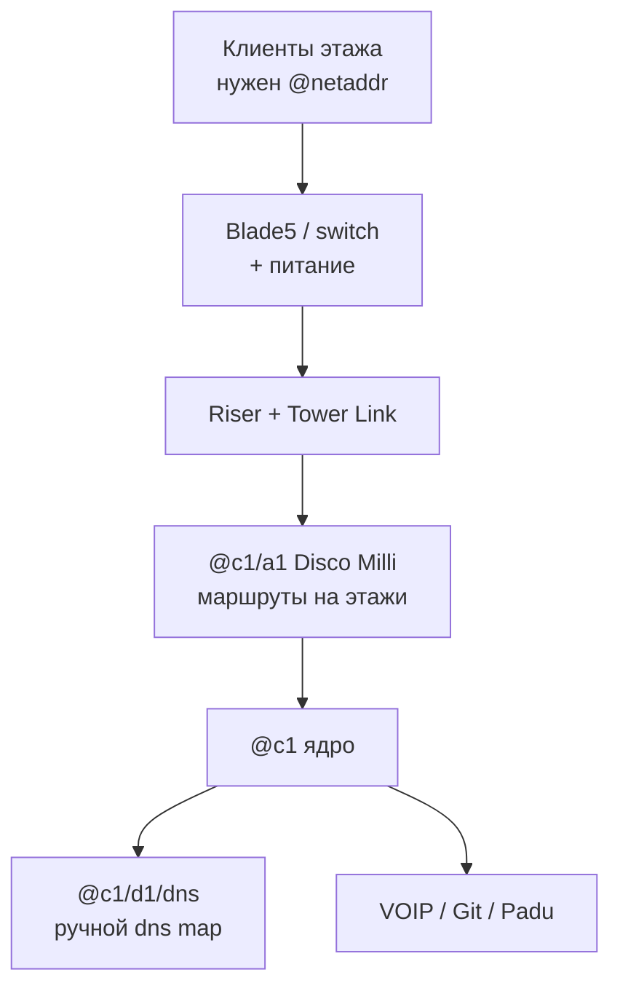

# Связь между этажами — гайд под твои настройки

Tower Networking Inc. Гайд заточен под **конкретный пресет** (см. ниже): без читов, без авто-DNS/авто-DHCP, с обязательными сетевыми адресами и реальной пропускной способностью.

## Твои настройки (сводка)

| Настройка | У тебя | Что это значит для гайда |
|-----------|--------|---------------------------|
| Свободная игра | Выкл | Обычный прогресс, без «песочницы без правил» |
| Start with all tech | Выкл | Технологии/команды открываются по ходу (cron, sftp и т.д. — не жди их с нуля) |
| Infinite money | Выкл | Считай бюджет; длины кабелей и число роутеров важны |
| Бесплатное электричество | Выкл | Питание этажа и DC стоит денег — не раздувай железо зря |
| Автосоздание DNS-записей | **Выкл** | DNS map делаешь **вручную** в netshell / Registry |
| Подсказки по подключению | Вкл | Можно опираться на подсказки линков в мире |
| Видеть ошибки/подсказки в мире | Вкл | Ошибки маршрутизации/линка видны в мире — смотри их до «магии route» |
| Бесконечная пропускная способность устройств | **Выкл** | Switch ≈ хаб: не сваливай весь этаж на один слабый Blade без нужды |
| Отладчику нужна свободная ПС | Выкл | Debugger проще в использовании по bandwidth |
| Столкновение устройств | Выкл | Расстановка проще |
| Локальные DNS записи | **Вкл** | Локальный DNS работает — после ручного `dns map` |
| Автозапуск установленных программ | **Выкл** | После `program install` программу может понадобиться **запустить вручную** |
| Для запросов нужны сетевые адреса | **Вкл** | Без `@netaddr` запросы клиентов **не пойдут** — `ncall` обязателен |
| Default user/device DHCP | **Выкл** | DHCP сам не раздаёт адреса — либо статика (`ncall`), либо потом поднимаешь DHCP сами |
| DHCP skip routing on source | Выкл | Обычная маршрутизация DHCP-трафика, когда дойдёшь до DHCP |

> **Главный вывод под твой пресет.** Связь этажа = (1) физический Tower Link + (2) **обязательные** net address на клиентах/свитче + (3) маршруты на роутере + (4) **ручные** DNS map. Без п.2 клиенты «немые», даже если кабель и route идеальны.

---

## Большая картина



Этажи без авто-DHCP и без авто-DNS: ты сам даёшь имена, сам прописываешь DNS, сам следишь за перегрузкой линков.

---

## Что купить (с учётом денег и ПС)

Длины меряй **T**. Один цвет кабеля = один заказ.

| Роль | Что брать | Зачем при твоих настройках |
|------|-----------|----------------------------|
| Коммутатор этажа | Blade5 (и ещё один на 2-й этаж) | Собрать клиентов; **не** жди бесконечной ПС — один слабый switch легко забьётся |
| Клиентский роутер | Disco Milli `@c1/a1` | Порты под riser этажей |
| Ядро | Disco Micro `@c1` | Клиентская ↔ серверная половины |
| Серверный роутер | Disco Milli `@c1/d1` | Сервисы |
| Серверы | Boulder+ под DNS/Git/VOIP | Платные сервисы; программы **не** автостартуют |
| Uplink | Customer Uplink 500–2000 | Switch → riser этажа |
| Патчи клиентов | Customer 1000–2000 | Клиент → switch |
| Связки DC | Router/Server 200–500 | Короткие линки в стойке |
| Питание | DC 200, UK plug, Tenabolt | Электричество **платное** |
| Debugger | + длинный Ethernet | `setdbg` / `always using` |

> **Tower Link.** Порт floor 0 (DC) ↔ порт этажа → cat1 → Request link. Запиши коды портов на A1 (пример из гайдов: один код = этаж 1, другой = этаж 2). Подсказки по подключению у тебя **включены** — сверяйся с ними, если линк не встаёт.

---

## Пошагово под твой пресет

### 1. Дебаггер и алиасы

```text
always using АДРЕС
```

или:

```text
setdbg АДРЕС
```

Сразу заведи `ncall`, `rca`, `rcd` — при обязательных net address их будет очень много.

### 2. Ядро DC + имена (статика)

DHCP по умолчанию **выключен** — это как раз твой случай: делай статику.

| Адрес | Роль |
|-------|------|
| `@c1` | Ядро |
| `@c1/a1` | Клиентский роутер |
| `@c1/d1` | Серверный роутер |
| `@c1/d1/dns` | DNS |
| `@c1/d1/voip` | VOIP |
| `@c1/d1/git` | Git / updates |

```text
ncall @имя @c1/d1/dns HARDWARE_ID
```

(`net address` + DNS + `dhcp disable` за раз.)

Свяжи роутеры маршрутами (`rca` / `rcd`): `@c1` ↔ `@c1/a1` ↔ `@c1/d1`, сервисы на портах `@c1/d1`.

### 3. Программы на серверах (без автозапуска)

```text
program install dns-server on @c1/d1/dns
program install …
```

У тебя **Автозапуск программ = Выкл** — после установки проверь, что сервис реально работает (`watch`, `program list`, трафик). При необходимости запусти/включи по `man` конкретной программы.

### 4. Riser-порты A1

Запиши, какой порт A1 смотрит на какой этаж (часто P0 = этаж 1, P1 = этаж 2).

### 5. Физика этажа

1. Switch у питания и ethernet-riser.  
2. DC 200 → switch.  
3. Клиенты → switch.  
4. Uplink switch → riser этажа.  
5. Tower Link: floor 0 ↔ этаж.  
6. Link lights с обеих сторон. Если нет — чини физику/Tower Link, не route.

### 6. Имена на этаже — обязательно

**Для запросов нужны сетевые адреса = Вкл** → без `@…` клиент не шлёт нормальные запросы.

```text
ncall @c1/a1/f1s1 @c1/d1/dns SWITCH_ID
ncall @c1/a1/f1c1 @c1/d1/dns CLIENT_ID
ncall @c1/a1/f2p1 @c1/d1/dns PRODUCER_ID
```

Клиенты могут спать — смотри Surveyor. Префикс `@c1/a1/f…` сильно упрощает маршруты.

### 7. Маршруты на A1

```text
rca @c1/a1/f1c1 0 @c1/a1
rca @c1/a1/f2p1 1 @c1/a1
```

Номер порта = куда воткнут riser этажа. Маршруты нужны **в обе стороны** цепочки.

При **конечной ПС** лучше по возможности вести этажи через prefix (`route add @c1/a1/f1 via port0 on @c1/a1`), а не плодить десятки host-route на всём пути — меньше записей, проще жить.

### 8. DNS — только вручную

Автосоздание DNS **выкл**, локальные записи **вкл**:

1. В Registry заведи домен / usage (VOIP, updates, ISP и т.д.).  
2. В netshell явно:

```text
dns map voip.none as @c1/d1/voip
dns map git.none as @c1/d1/git
dns map имя_продюсера.xxx as @c1/a1/f2p1
```

Без этого клиент с правильным `@` и route всё равно не найдёт сервис по имени.

### 9. Проверка

```text
ping @c1/a1/f1s1
ping @c1/a1/f2p1
trace @c1/d1/dns from @c1/a1/f1c1
```

Ошибки в мире у тебя **видны** — если подсказка орёт про адрес/маршрут, правь это раньше, чем покупать новый роутер.

---

## Prefix routing (кратко)


Иерархия имён + маршрут на префикс вместо маршрута на каждый хост — особенно полезно, пока ПС устройств конечна.

```text
route add @c1/a1/f1 via port0 on @c1/a1
route add @c1 via portN on @c1/a1
```

---

## Алиасы (копипаст)

```text
alias setdbg always using $1
alias ncall net address set $1 on $3; net dns set $2 on $3; net dhcp disable on $3
alias rca route add $1 via port$2 on $3
alias rcat route add traffic $1 via port$2 on $3
alias rcd route default via port$1 on $2
alias nca net address set $1 on $2
alias nodhcp net dhcp disable on $1
```

| Алиас | Зачем при твоих настройках |
|-------|----------------------------|
| `setdbg` | Быстрый debugger |
| `ncall` | Обязательные net address + DNS + static |
| `rca` / `rcd` / `rcat` | Маршруты этажей и трафика |
| `nodhcp` | DHCP и так off by default — но полезно после экспериментов с DHCP |

`watchhost` / cron — только после unlock tech (у тебя all tech с старта **выкл**).

---

## Чеклист под твой пресет

- [ ] `setdbg` / `always using`
- [ ] Ядро `@c1` ↔ `@c1/a1` ↔ `@c1/d1` с маршрутами
- [ ] Сервисы установлены; при необходимости **запущены вручную**
- [ ] Riser-коды A1 записаны
- [ ] Этаж: питание, switch, клиенты, uplink, Tower Link, link lights
- [ ] **`ncall` на switch и всех клиентов/продюсеров** (адреса обязательны)
- [ ] `rca` с A1 на этаж/хосты
- [ ] **Ручной** `dns map` для доменов и продюсеров
- [ ] `ping` / `trace`; смотри подсказки в мире

---

## Частые ошибки именно на этом пресете

| Симптом | Частая причина у тебя |
|---------|------------------------|
| Кабель есть, «интернета» нет | Нет `@netaddr` на клиенте (обязательные адреса) |
| Имя сервиса не резолвится | Не сделал ручной `dns map` (авто-DNS выкл) |
| После install «тишина» | Программа не автостартует |
| Этаж тормозит / всё красное | Перегруз Blade/линка (ПС конечна) |
| DHCP «ничего не раздал» | Default DHCP выкл — это нормально, пока сам не поднимешь dnsmasq/kea |
| Свет зашкаливает счёт | Бесплатного электричества нет |

---

## DHCP позже (опционально)

Сейчас default DHCP выкл — для старта это хорошо (меньше магии). Когда этажей много:

1. Подними DHCP-сервер сам (`program install dnsmasq` / kea).  
2. `dhcp option prefix` / `dns` / `bind`.  
3. Маршрут на UDP/67.  
4. Не забудь: автосоздание DNS всё равно **выкл** — домены сервисов map-ишь руками.

---

## Источники

- Steam: [Hitchhiker's Guide](https://steamcommunity.com/sharedfiles/filedetails/?id=3651464033)
- Обсуждения Routers, HackMD Aliases / device-tables
- Внутриигровой tutorial: Riser Setup Across Floors

Сверяй `man route`, `man net`, `man dns` на своей beta-сборке.

Интерактивный канвас в Cursor: папка `canvases` воркспейса. Рядом в репо: [`tni-floor-connectivity.canvas.tsx`](./tni-floor-connectivity.canvas.tsx) (исходник UI-канваса).
