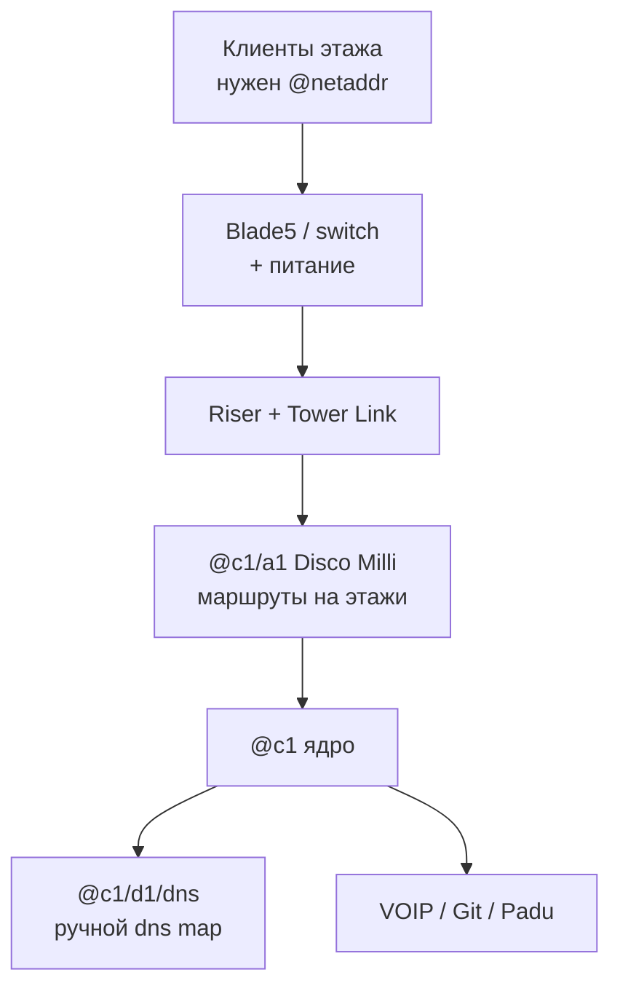
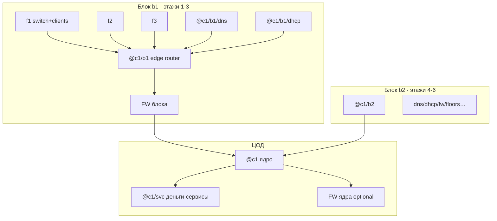

# Связь между этажами — гайд под твои настройки

Tower Networking Inc. Гайд заточен под **конкретный пресет** (см. ниже): без читов, без авто-DNS/авто-DHCP, с обязательными сетевыми адресами и реальной пропускной способностью.

Содержание дальше по файлу: режимы A/B → пошагово → как работает сеть → алиасы → чеклисты → бэкапы/Morris → **Registry/ISP, телефоны/камеры, VLAN, RIP, pcap, blackhole, таблица портов, Tower Link**.

## Твои настройки (сводка)

| Настройка | У тебя | Что это значит для гайда |
|-----------|--------|---------------------------|
| Свободная игра | Выкл | Обычный прогресс, без «песочницы без правил» |
| Start with all tech | Выкл | Технологии/команды открываются по ходу (cron, sftp и т.д. — не жди их с нуля) |
| Infinite money | Выкл | Считай бюджет; длины кабелей и число роутеров важны |
| Бесплатное электричество | Выкл | Питание этажа и DC стоит денег — не раздувай железо зря |
| Автосоздание DNS-записей | **Выкл** | DNS map делаешь **вручную** в netshell / Registry |
| Подсказки по подключению | Вкл | Можно опираться на подсказки линков в мире |
| Видеть ошибки/подсказки в мире | Вкл | Ошибки маршрутизации/линка видны в мире — смотри их до «магии route» |
| Бесконечная пропускная способность устройств | **Выкл** | Switch ≈ хаб: не сваливай весь этаж на один слабый Blade без нужды |
| Отладчику нужна свободная ПС | Выкл | Debugger проще в использовании по bandwidth |
| Столкновение устройств | Выкл | Расстановка проще |
| Локальные DNS записи | **Вкл** | Локальный DNS работает — после ручного `dns map` |
| Автозапуск установленных программ | **Выкл** | После `program install` программу может понадобиться **запустить вручную** |
| Для запросов нужны сетевые адреса | **Вкл** | Без `@netaddr` запросы клиентов **не пойдут** — `ncall` обязателен |
| Default user/device DHCP | **Выкл** | DHCP сам не раздаёт адреса — либо статика (`ncall`), либо потом поднимаешь DHCP сами |
| DHCP skip routing on source | Выкл | Обычная маршрутизация DHCP-трафика, когда дойдёшь до DHCP |

> **Главный вывод под твой пресет.** Связь этажа = (1) физический Tower Link + (2) **обязательные** net address на клиентах/свитче + (3) маршруты на роутере + (4) **ручные** DNS map. Без п.2 клиенты «немые», даже если кабель и route идеальны.

---

## Большая картина



Этажи без авто-DHCP и без авто-DNS: ты сам даёшь имена, сам прописываешь DNS, сам следишь за перегрузкой линков.

---

## Два режима: минимум сейчас vs «не перестраивать потом»

Идея из гайдов сообщества: **не вешать всю башню на один DNS/DHCP в ЦОД**, а резать этажи на **блоки (поды) по ~3 этажа**. У каждого блока свой edge-роутер, свой DNS, свой DHCP; блок одним-двумя uplink’ами ходит в ядро ЦОД. Плюс firewall на границе блока/ядра — иначе Morris и скрейперы кладут всю башню разом.

Ниже — **A = старт** (дешево, быстро онлайн) и **B = нормальная эксплуатация** (масштабируется). Важно: даже в A заложи **имена и топологию как у B**, иначе при росте придётся переименовывать половину сети.

### Правило имён (общее для A и B)

```text
@c1                    ядро ЦОД
@c1/svc/…              деньги: voip, git, padu, root-dns (опционально)
@c1/b1                 блок 1 (этажи 1–3) — edge-роутер
@c1/b1/dns             DNS блока 1
@c1/b1/dhcp            DHCP блока 1
@c1/b1/f1 … f3         этажи внутри блока
@c1/b1/f1/s1           switch этажа
@c1/b1/f1/c1           consumer
@c1/b1/f2/p1           producer
@c1/b2 …               следующий блок этажей 4–6
```

Так новый блок = новый префикс `@c1/bN`. На ядре ЦОД добавляешь **один** route на `@c1/bN`, а не сотню host-route. Старые блоки не трогаешь → ничего «не отрубается» при расширении.



---

## Режим A — минимальная комплектация (день 1–несколько этажей)

Цель: этажи живы, деньги капают, **бюджет минимальный**. Пока **один** логический «блок» `b1`, DNS/DHCP можно временно держать в ЦОД или на том же edge — но адреса уже `@c1/b1/…`.

### ЦОД (обязательно в A)

| Железо / роль | Пример | Зачем |
|---------------|--------|--------|
| Debugger | — | `setdbg` |
| Ядро | Disco Micro `@c1` | Сшивка |
| Edge «блока 1» *(можно пока в ЦОД)* | Disco Milli `@c1/b1` | Сюда все riser этажей 1–3 |
| Серверный/сервисный роутер | Disco Milli `@c1/svc` или `@c1/d1` | VOIP/Git/Padu |
| DNS (один на старт) | Boulder+ `@c1/b1/dns` *или* `@c1/svc/dns` | У тебя авто-DNS выкл |
| 1–2 money-сервиса | VOIP / GitCoffee | Иначе этажи не кормят |
| Кабели + питание | short copper | — |

Firewall в A **можно отложить на 1–2 дня**, но порт под него на uplink’е лучше оставить свободным / заложить в схему.

### На каждом этаже (A)

| Обязательно | Не обязательно пока |
|-------------|---------------------|
| Blade5 + питание | Свой роутер на этаже |
| Патчи клиент→switch | Свой DNS/DHCP на этаже |
| Uplink→riser + Tower Link | Firewall на каждом этаже |
| `ncall` всем (адреса обязательны) | |

До 3 этажей: **все uplink’и в `@c1/b1`**, не плоди второй клиентский роутер «на каждый этаж».

### Что сознательно НЕ делай в A (чтобы не ломать B)

- Не называй DNS просто `@dns` — сразу `@c1/b1/dns` или `@c1/svc/rootdns`.
- Не вешай этаж 4+ на тот же `@c1/b1` «навсегда» — заведи `@c1/b2`.
- Не смешивай money-сервисы и клиентский трафик на одном слабом Blade без роутера.

---

## Режим B — нормальная эксплуатация (блоки по 3)

Цель: рост башни = **добавить блок**, а не перепаять ЦОД. Изоляция сбоев: умер DHCP `b2` — живы `b1` и сервисы в ЦОД.

### ЦОД в B (стабильное ядро)

| Роль | Что ставить | Заметки |
|------|-------------|---------|
| Ядро | Более жирный роутер (`@c1`) | Только prefix-route на `@c1/bN` и `@c1/svc` |
| Money / root services | Роутер `@c1/svc` + серверы VOIP, Git, Padu, опц. root DNS | Ручной `dns map` доменов сюда |
| Uplink’и блоков | Порт(ы) ядра на каждый `@c1/bN` | Один линк на блок минимум; лучше + запасной |
| FW ядра | Firewall перед `@c1/svc` | Default deny + allow нужных портов (53, 67, 80, 443, 5060, 23…) |
| Питание / запас | Tenabolt, UPS-логика по желанию | Электричество платное |
| Бэкапы (когда откроют sftp) | NAS + cron/sftp конфигов роутеров | Иначе смерть warranty = полный rebuild |

В ЦОД **не** обязательно держать DHCP каждого блока — DHCP живёт **в блоке**. Root DNS в ЦОД опционален: клиенты блоков смотрят на `@c1/bN/dns`, а тот уже знает money-домены (или форвардит/имеет те же map’ы).

### Один блок `bN` (этажи 3N-2 … 3N) — комплект

| Роль | Где физически | Зачем |
|------|---------------|--------|
| Edge-роутер `@c1/bN` | ЦОД или «этаж-хаб» блока | Все 3 этажа + DNS/DHCP блока |
| DNS `@c1/bN/dns` | Рядом с edge (часто ЦОД/серверная блока) | Локальный резолв; ручные map |
| DHCP `@c1/bN/dhcp` | То же | `prefix @c1/bN/`, `dns @c1/bN/dns`, bind продюсеров |
| Firewall блока | На uplink блоке→ядро | Режет Morris/scraper до ядра; падение FW блока не роняет другие блоки, если ядро отдельно |
| На каждом из 3 этажей | Switch + питание + патчи + Tower Link | Как в A |
| Опц. этажный mini-router | Только если ПС/VLAN разъехались | Не обязательно на старте B |

Hitchhiker прямо говорит: DHCP удобен, когда **несколько consumer-этажей** сходятся в один роутер — это и есть блок.

### Трафик и FW (B)

Типичный allow (whitelist / default deny), см. также Steam «Firewalls - Basics»:

- `tcp/23` — управление (сначала себе, иначе залочишься; Datawiper = factory reset)
- `udp/53` — DNS
- `udp/67` — DHCP (если DHCP за FW)
- `tcp/80`, `tcp/443`, `udp/5060`, `udp/554`, `icmp`, … по сервисам
- deny Morris-диапазоны / scraper (`tcp/510–519`, `tcp/8034`) как минимум на пути к роутерам/серверам

### Как добавить этажи 4–6 без даунтайма b1

1. Собираешь `@c1/b2` (роутер + dns + dhcp + fw) **рядом**, ещё не режешь старое.  
2. Вешаешь этажи 4–6 на `b2`, Tower Link, имена `@c1/b2/f…`.  
3. На `@c1`: `rca @c1/b2 PORT @c1` (и обратный default/prefix с b2 в ядро).  
4. Money-домены уже в Registry; на `@c1/b2/dns` те же `dns map` (или общая схема).  
5. Только потом, если нужно, снимаешь лишнюю нагрузку с `b1`.

Старый блок **не переименовываешь** → клиенты b1 не отваливаются.

---

## Сводка: ЦОД vs этаж vs блок

| | Режим A (мин.) | Режим B (норма) |
|--|----------------|-----------------|
| **ЦОД** | Ядро + edge b1 + 1 DNS + money-серверы | Ядро + svc + FW + uplink’и на каждый блок |
| **Блок** | Логически один (`b1`), железо может стоять в ЦОД | Edge + DNS + DHCP + FW на каждые ~3 этажа |
| **Этаж** | Switch + питание + uplink + `ncall` | То же; роутер на этаже — по необходимости |
| **DNS** | Один, но с «правильным» именем | Свой на блок (+ опц. root в ЦОД) |
| **DHCP** | Позже / один | Свой на блок (`prefix` блока) |
| **FW** | Можно отложить | На uplink блока и перед money |

---

## Что купить (закупка)

Длины меряй **T**. Один цвет = один заказ.

### Закупка A (старт)

| Роль | Что брать |
|------|-----------|
| Edge + ядро | Disco Milli + Disco Micro |
| DNS (+ VOIP/Git) | Boulder+ ×2–3 |
| Этаж | Blade5 × число этажей, DC 200, uplink 500–2000, патчи |
| DC | Короткие Router/Server линки, UK plug / Tenabolt |
| Debugger | длинный Ethernet |

### Докупка при переходе A→B (на каждый новый блок)

| Роль | Что брать |
|------|-----------|
| Edge блока | Disco Milli (или новее по дню) |
| DNS блока | Boulder / Boulder+ |
| DHCP блока | тот же или второй сервер / вторая VM |
| Firewall | 1× на uplink блока (+ 1× перед `@c1/svc` если ещё нет) |
| Линк в ядро | copper/fiber по расстоянию |
| 3 этажа | Blade5 ×3 + питание + uplink’и + Tower Link |

> **Tower Link.** Порт floor 0 (или этажа-хаба) ↔ порт этажа → cat1 → Request link. Подсказки по подключению у тебя включены.

---

## Пошагово под твой пресет

### 1. Дебаггер и алиасы

```text
always using АДРЕС
```

или:

```text
setdbg АДРЕС
```

Сразу заведи `ncall`, `rca`, `rcd` — при обязательных net address их будет очень много.

### 2. Ядро + первый блок (имена как в B, железо как в A)

DHCP по умолчанию **выключен** — статика через `ncall` нормальна на старте.

| Адрес | Роль |
|-------|------|
| `@c1` | Ядро |
| `@c1/b1` | Edge первого блока (этажи 1–3) |
| `@c1/svc` | Money/сервисы (или `@c1/d1`) |
| `@c1/b1/dns` | DNS блока 1 |
| `@c1/svc/voip` | VOIP |
| `@c1/svc/git` | GitCoffee |

```text
ncall @имя @c1/b1/dns HARDWARE_ID
```

Маршруты: `@c1` ↔ `@c1/b1` ↔ этажи; `@c1` ↔ `@c1/svc` ↔ серверы.

### 3. Программы (без автозапуска)

```text
program install dns-server on @c1/b1/dns
```

Проверь `watch` / `program list` — автозапуск у тебя выкл.

### 4. Riser-порты edge `@c1/b1`

Запиши порт → этаж (P0 = f1, P1 = f2, …).

### 5. Физика этажа

1. Switch + питание у riser.
2. Клиенты → switch.
3. Uplink → riser + Tower Link.
4. Link lights; иначе чини физику.

### 6. Имена на этаже

```text
ncall @c1/b1/f1/s1 @c1/b1/dns SWITCH_ID
ncall @c1/b1/f1/c1 @c1/b1/dns CLIENT_ID
ncall @c1/b1/f2/p1 @c1/b1/dns PRODUCER_ID
```

### 7. Маршруты на edge блока

```text
rca @c1/b1/f1 0 @c1/b1
rca @c1/b1/f2 1 @c1/b1
```

Лучше prefix на этаж, чем host на каждого жильца на всём пути. Default/prefix в ядро с `@c1/b1`.

### 8. DNS вручную

```text
dns map voip.none as @c1/svc/voip
dns map git.none as @c1/svc/git
dns map имя_продюсера.xxx as @c1/b1/f2/p1
```

Map на том DNS, на который смотрят клиенты (`@c1/b1/dns`).

### 9. Проверка

```text
ping @c1/b1/f1/s1
trace @c1/b1/dns from @c1/b1/f1/c1
trace @c1/svc/voip from @c1/b1/f1/c1
```

---

## Prefix routing (кратко)


```text
route add @c1/b1/f1 via port0 on @c1/b1
route add @c1 via portN on @c1/b1
route add @c1/b1 via portM on @c1
```

---

## Как это работает (подробно)

### Три адреса одной сущности

1. **Hardware ID** — число вроде `37157`. Уникальный «серийник» порта/устройства. Им можно бить команды напрямую, но маршруты на каждый HW ID — ад.
2. **Network address (`@…`)** — человекочитаемое имя в сети (`@c1/b1/f1/c1`). При твоей настройке **«для запросов нужны сетевые адреса»** клиент без `@` почти бесполезен.
3. **DNS-имя** (`voip.none`) — то, что видит жилец в «интернете». Резолвится DNS-сервером в `@` или HW. У тебя **автосоздание DNS выкл** → запись появляется только после `dns map`.

Цепочка запроса жильца: приложение спрашивает DNS → DNS отдаёт `@цели` → роутеры ведут пакет по **маршрутам** к порту → устройство отвечает. Обрыв на любом шаге = «интернета нет», даже если кабель воткнут.

### Физика: switch, riser, Tower Link

- **Switch (Blade…)** в этой игре ближе к **хабу**: заливает трафик в порты и легко упирается в **конечную ПС** (у тебя бесконечной ПС нет). Поэтому «все этажи на один Blade» — плохая стратегия роста.
- **Riser** — вертикальная шахта портов между этажами. Сам по себе кабель «с лестницы» линк не поднимает.
- **Tower Link** — заказ связи floor A port X ↔ floor B port Y. Пока Request link не сделан и link lights не горят, логика сети бессмысленна.
- **Роутер** смотрит таблицу маршрутов и шлёт кадр **в один** next-hop порт. Это граница сегментов и место для prefix/DHCP/FW.

### Debugger: `always using`

Многие команды требуют `using <debugger>`. `always using ADDR` запоминает дебаггер, чтобы не писать `using` каждый раз. Без живого дебаггера на линке netshell «не дотягивается» до удалённых процедур.

### Маршрутизация

На роутере есть:

| Тип | Пример | Смысл |
|-----|--------|--------|
| Host / netaddr | `route add @c1/b1/f1/p1 via port0 on @edge` | Точный адрес → порт |
| Prefix | `route add @c1/b1/f1 via port0 on @edge` | Всё под префиксом → порт |
| Traffic | `route add traffic udp/5060 via port2 on @edge` | Класс трафика (VOIP и т.п.) |
| Default | `route default via port7 on @edge` | «Всё остальное» |
| Default drop | `route default drop on @edge` | Остальное выкинуть |

Метафора из гайдов: нет билета (route) — можно только уйти в default/exit. Prefix routing экономит записи: роутер, не зная точный хост, поднимает пакет к более короткому префиксу (`@c1/b1/f1/c1` → есть route на `@c1/b1` → в ядро).

Обратный путь тоже нужен: сервисы должны уметь ответить клиенту (или ответит симметрия через default’ы — проверяй `trace` в обе стороны).

### DNS

- `dns map domain as @target [on @dns]` — создать запись (у тебя вручную).
- Клиенту нужен `net dns set @c1/b1/dns` (через `ncall` / DHCP option dns).
- Локальные DNS записи **вкл** — map на твоём сервере работают.
- Money-домены заводятся ещё и в **Registry** (usage/PPU), иначе «сайт» не продаётся.

### DHCP

По умолчанию user/device DHCP у тебя **выкл** — никто сам адреса не раздаёт.

Когда поднимешь dnsmasq/kea на `@c1/bN/dhcp`:

- `dhcp option prefix @c1/bN/` — новым клиентам имена вида `@c1/bN/…`
- `dhcp option dns @c1/bN/dns` — куда ходить за резолвом
- `dhcp option bind HW as @fixed` — продюсер/DNS всегда с тем же `@`
- На роутере нужен путь для DHCP (часто `route add traffic udp/67 …` / broadcast) к серверу

DHCP **не** создаёт DNS map доменов Registry — только netaddr и какой DNS использовать.

### Firewall

- Стоит **на пути** пакетов (линк через FW). Без правил ≈ прозрачный tap (default allow).
- **Whitelist:** сначала `allow` нужное, в конце `firewall default deny`. Без default deny whitelist «не включается».
- **Blacklist:** `default allow` + `deny` мусора (Morris/scraper).
- Управление — **tcp/23**. Режь его последним в голове: сначала allow tcp/23 себе, потом default deny. Иначе Datawiper.
- Отброшенный трафик обычно не ест ПС FW так же, как полезный — deny-листы дешёвые; всё же режь зло рано (на uplink блока).

### Программы и автозапуск

`program install X on @srv` ставит софт. У тебя **автозапуск выкл** — после install проверяй, что сервис жив (`watch`, трафик, `program list`). Иначе «DNS установлен», а запросов никто не слушает.

### Алиасы: как устроены

- Хранятся в userdata `settings.json` → `cmd_alias`.
- `$1` `$2` `$3` — аргументы вызова; в середину слова (`f1/$1`) **не** вставляются.
- `port$2` в `rca` склеивает `port` + номер → пиши `rca @x 0 @r`, не `port0`.
- Несколько команд — через `;`.
- `try … then … else …` — успех/провал (нужна процедура `try` в билде).
- Имя алиаса не должно совпадать с reserved (`route`, `firewall`, `echo`, …).
- Ниже у каждого алиаса в начале `echo …` — краткий мануал **при каждом запуске** (echo в мультиплеере виден всем в терминале; в соло это просто лог).

---

## Библиотека алиасов (проверено / переписано)

Создание в игре: `alias имя команда…`  
Или вставь через Alias Studio / правку `cmd_alias`.  
Удаление: `alias имя`.

Только строки алиасов без пояснений: [`alias-pack.txt`](./alias-pack.txt).

Скопируй блоки целиком. Где нужен unlock (sftp/cron/try) — подписано.

### База: debugger, netaddr, просмотр

```text
alias setdbg echo usage: setdbg DEBUGGER_ADDR; always using $1
alias nca echo usage: nca NETADDR DEVICE; net address set $1 on $2
alias ncdns echo usage: ncdns DNS_ADDR DEVICE; net dns set $1 on $2
alias nodhcp echo usage: nodhcp DEVICE; net dhcp disable on $1
alias ncall echo usage: ncall NETADDR DNS_ADDR DEVICE; net address set $1 on $3; net dns set $2 on $3; net dhcp disable on $3
alias rsh echo usage: rsh ROUTER; route show on $1
alias fsh echo usage: fsh FIREWALL; firewall show on $1
alias dsh echo usage: dsh DNS; dns show on $1
alias wdev echo usage: wdev ADDR; watch $1
alias pdev echo usage: pdev ADDR; ping $1
alias trc echo usage: trc DEST from SRC; trace $1 from $2
```

Примеры:

```text
setdbg 37157
ncall @c1/b1/f1/c1 @c1/b1/dns 12001
rsh @c1/b1
```

### Маршруты

```text
alias rca echo usage: rca DEST_OR_PREFIX PORTNUM ROUTER; route add $1 via port$2 on $3
alias rcat echo usage: rcat TRAFFIC PORTNUM ROUTER; route add traffic $1 via port$2 on $3
alias rcd echo usage: rcd PORTNUM ROUTER; route default via port$1 on $2
alias rcdo echo usage: rcdo ROUTER; route default drop on $1
alias rcb echo usage: rcb ROUTER; route enable broadcast on $1
alias rr echo usage: rr HASHNUM ROUTER; route remove $1 on $2
alias rcl echo usage: rcl ROUTER; route clear on $1
alias ra echo usage: ra ...continues as route add; route add
alias rrm echo usage: rrm ...continues as route remove; route remove
```

Примеры под блок:

```text
rca @c1/b1/f1 0 @c1/b1
rca @c1/b1/f2 1 @c1/b1
rca @c1 7 @c1/b1
rcd 7 @c1/b1
rcat udp/67 3 @c1/b1
rcat udp/5060 2 @c1/svc
```

Смысл `rca`: `$1` = куда слать, `$2` = номер порта без слова port, `$3` = роутер.

### DNS

```text
alias dmap echo usage: dmap DOMAIN TARGET [DNS]; dns map $1 as $2 on $3
alias dmapd echo usage: dmapd DOMAIN TARGET - uses always/default dns context; dns map $1 as $2
alias dunmap echo usage: dunmap DOMAIN DNS; dns unmap $1 on $2
alias dlook echo usage: dlook DOMAIN; dns lookup $1
```

Пример:

```text
dmap voip.none @c1/svc/voip @c1/b1/dns
dmap git.none @c1/svc/git @c1/b1/dns
dmap instan_blind.xxx @c1/b1/f2/p1 @c1/b1/dns
```

Если `on $3` ругается без третьего аргумента — используй `dmapd` при уже выбранном DNS/`always on`.

### DHCP (нужен установленный dhcp-сервер)

```text
alias dhs echo usage: dhs DHCP; dhcp show on $1
alias dhprefix echo usage: dhprefix PREFIX DHCP; dhcp option prefix $1 on $2
alias dhdns echo usage: dhdns DNS [DNS2] DHCP; dhcp option dns $1 on $2
alias dhdns2 echo usage: dhdns2 DNS1 DNS2 DHCP; dhcp option dns $1 $2 on $3
alias dhbind echo usage: dhbind HWADDR NETADDR DHCP; dhcp option bind $1 as $2 on $3
alias dhunbind echo usage: dhunbind HWADDR DHCP; dhcp option unbind $1 on $2
alias dhlease echo usage: dhlease SECONDS DHCP; dhcp option lease $1 on $2
```

Типичный блок:

```text
dhprefix @c1/b1/ @c1/b1/dhcp
dhdns @c1/b1/dns @c1/b1/dhcp
dhbind 55421 @c1/b1/f2/p1 @c1/b1/dhcp
rcat udp/67 4 @c1/b1
```

### Firewall — длинные пресеты и поштучно

**Важно:** `fcall` = whitelist. Порядок: allow’ы, **последним** `default deny`. Сначала всегда закладываем **tcp/23** (управление).

```text
alias fcclear echo usage: fcclear FIREWALL - wipe all rules; firewall clear on $1
alias fcdefa echo usage: fcdefa FIREWALL - default allow; firewall default allow on $1
alias fcdefd echo usage: fcdefd FIREWALL - default deny; firewall default deny on $1
alias fcadbug echo usage: fcadbug FIREWALL - allow tcp/23 mgmt; firewall allow tcp/23 on $1
alias fcadns echo usage: fcadns FIREWALL; firewall allow udp/53 on $1
alias fcadhcp echo usage: fcadhcp FIREWALL; firewall allow udp/67 on $1
alias fcavoip echo usage: fcavoip FIREWALL; firewall allow udp/5060 on $1
alias fcacam echo usage: fcacam FIREWALL; firewall allow udp/554 on $1
alias fcaicmp echo usage: fcaicmp FIREWALL; firewall allow icmp on $1
alias fcastore echo usage: fcastore FIREWALL; firewall allow tcp/80 on $1
alias fcaupdate echo usage: fcaupdate FIREWALL; firewall allow tcp/443 on $1
alias fcainstruct echo usage: fcainstruct FIREWALL; firewall allow udp/1194 on $1
alias fcadec echo usage: fcadec FIREWALL; firewall allow udp/8333 on $1
```

Полный whitelist (переписан с Hitchhiker `fcall`, + echo-мануал; tcp/23 первым):

```text
alias fcall echo usage: fcall FIREWALL - whitelist common + default deny - lockout risk without tcp/23; firewall allow tcp/23 on $1; firewall allow udp/53 on $1; firewall allow udp/67 on $1; firewall allow udp/5060 on $1; firewall allow udp/554 on $1; firewall allow icmp on $1; firewall allow tcp/80 on $1; firewall allow tcp/443 on $1; firewall allow udp/1194 on $1; firewall allow udp/8333 on $1; firewall default deny on $1
```

Blacklist Morris/scraper при default allow (Hitchhiker `fcmal` + echo):

```text
alias fcmal echo usage: fcmal FIREWALL - deny morris 510-519 and scraper 8034 - keep default allow; firewall deny tcp/8034 on $1; firewall deny tcp/510 on $1; firewall deny tcp/511 on $1; firewall deny tcp/512 on $1; firewall deny tcp/513 on $1; firewall deny tcp/514 on $1; firewall deny tcp/515 on $1; firewall deny tcp/516 on $1; firewall deny tcp/517 on $1; firewall deny tcp/518 on $1; firewall deny tcp/519 on $1
```

Комбо «сначала не умереть от Morris, потом ужесточить» для uplink блока:

```text
alias fcsafe echo usage: fcsafe FIREWALL - mal deny then whitelist default deny; firewall deny tcp/8034 on $1; firewall deny tcp/510 on $1; firewall deny tcp/511 on $1; firewall deny tcp/512 on $1; firewall deny tcp/513 on $1; firewall deny tcp/514 on $1; firewall deny tcp/515 on $1; firewall deny tcp/516 on $1; firewall deny tcp/517 on $1; firewall deny tcp/518 on $1; firewall deny tcp/519 on $1; firewall allow tcp/23 on $1; firewall allow udp/53 on $1; firewall allow udp/67 on $1; firewall allow udp/5060 on $1; firewall allow udp/554 on $1; firewall allow icmp on $1; firewall allow tcp/80 on $1; firewall allow tcp/443 on $1; firewall allow udp/1194 on $1; firewall allow udp/8333 on $1; firewall default deny on $1
```

Пример: `fcall @c1/b1/fw` или `fcsafe @c1/svc/fw`.

### Программы (install)

```text
alias pip1 echo usage: pip1 SERVER - padu_v1; program install padu_v1 on $1
alias pigitc echo usage: pigitc SERVER - gitcoffee; program install gitcoffee on $1
alias pivoip echo usage: pivoip SERVER - voip-server; program install voip-server on $1
alias pidns2 echo usage: pidns2 SERVER - dns-server; program install dns-server on $1
alias pidhcp1 echo usage: pidhcp1 SERVER - dnsmasq; program install dnsmasq on $1
alias pidhcp2 echo usage: pidhcp2 SERVER - kea; program install kea on $1
alias morsr echo usage: morsr SERVER NAME - uninstall morris on server; program uninstall $2 on $1
```

После install у тебя нет автозапуска — проверь сервис руками.

### Скелет блока: имена edge/dns (ручной каркас)

Подставь свои HW ID:

```text
alias mkedge echo usage: mkedge EDGE_NET DNS_NET EDGE_HW - static edge; ncall $1 $2 $3
```

Практика без мега-алиаса (надёжнее пошагово):

```text
ncall @c1/b1 @c1/b1/dns EDGE_HW
ncall @c1/b1/dns @c1/b1/dns DNS_HW
ncall @c1/b1/dhcp @c1/b1/dns DHCP_HW
pidns2 @c1/b1/dns
pidhcp1 @c1/b1/dhcp
dhprefix @c1/b1/ @c1/b1/dhcp
dhdns @c1/b1/dns @c1/b1/dhcp
```

### Бэкапы / DR (нужны sftp + желательно cron + try)

```text
alias sfls echo usage: sfls DEVICE; sftp ls on $1
alias sfcp echo usage: sfcp PATH SRC DST RENAMETO; sftp cp $1 on $2 to $3 rename $4
alias sfrm echo usage: sfrm PATH DEVICE; sftp rm $1 on $2
alias bkroutes echo usage: bkroutes ROUTER NAS - copy routes.conf; echo backup routes $1 to $2; sftp cp /etc/routes.conf on $1 to $2 rename /backups/$1/routes.conf
alias bkfw echo usage: bkfw FW NAS - copy nftables.conf; echo backup fw $1 to $2; sftp cp /etc/nftables.conf on $1 to $2 rename /backups/$1/nftables.conf
alias cpfw echo usage: cpfw FW_SRC FW_DST - clone firewall config; sftp cp /etc/nftables.conf from $1 to $2
alias morrt echo usage: morrt ROUTER PATH - rm morris binary via sftp; sftp rm $2 on $1
```

Автобэкап (как в Hitchhiker; **нужны** cron и `try`):

```text
alias drstart echo usage: drstart CONFNAME DEVICE NAS - wake nas copy suspend; power wake on $3; sftp cp /etc/$1.conf on $2 to $3 rename /backups/$2/$1.conf; power suspend on $3; echo Backup of $2 attempted
alias drtest echo usage: drtest CONFNAME DEVICE NAS; try drstart $1 $2 $3 else notify Backup for $2 failed
alias crdr echo usage: crdr CONFNAME DEVICE NAS - hourly; cron add hourly drtest $1 $2 $3
alias crping echo usage: crping ADDR - ping every 30m; cron add */30 try ping $1 else notify Connection to $1 failed from Debugger
```

Если `try` в билде «неизвестная процедура» — не ставь `drtest`/`crping`, пока не появится; используй ручной `bkroutes`.

### QoL

```text
alias q echo usage: q - quit netshell; quit
alias cls echo usage: cls - clear screen; clear
```

---

## Чеклист


### Режим A
- [ ] Имена уже в схеме `@c1/b1/…` (не «плоский» `@dns`)
- [ ] Ядро + edge b1 + DNS + money-сервис
- [ ] Этажи: switch, питание, Tower Link, `ncall`
- [ ] Prefix-route этажей на b1; b1↔ядро↔svc
- [ ] Ручной `dns map`
- [ ] `ping` / `trace`

### Переход / режим B
- [ ] FW на uplink b1→ядро и/или перед `@c1/svc`
- [ ] DHCP `@c1/b1/dhcp` с `prefix @c1/b1/`, `dns @c1/b1/dns`, bind продюсеров
- [ ] Новый блок `@c1/b2` собран **до** перегрузки b1
- [ ] На ядре один route на `@c1/b2` — старый b1 не трогали
- [ ] DNS map на DNS нового блока
- [ ] Бэкапы конфигов (когда sftp открыт)

---

## Частые ошибки на твоём пресете

| Симптом | Причина |
|---------|---------|
| Кабель есть, запросов нет | Нет `@netaddr` |
| Имя не резолвится | Нет ручного `dns map` |
| Install «тишина» | Нет автозапуска программ |
| Весь ЦОД лёг из‑за одного этажа | Нет блоков/FW; всё на одном DNS/роутере |
| Этажи 4+ «ломают» 1–3 | Повесил новых на b1 вместо b2 |
| DHCP молчит | Default DHCP выкл — нужен свой сервер + route 67 |
| Счёт за свет | Бесплатного электричества нет |

---

## DHCP в блоке (режим B)

1. `program install dnsmasq` (или kea) on `@c1/bN/dhcp`.  
2. `dhcp option prefix @c1/bN/ on @c1/bN/dhcp`  
3. `dhcp option dns @c1/bN/dns on @c1/bN/dhcp`  
4. `dhcp option bind` для продюсеров / DNS.  
5. `rcat udp/67 …` на edge к DHCP.  
6. Авто-DNS всё равно **выкл** — домены money map-ишь руками на DNS блока.

---

## Гарантия, смерть железа и замена

После окончания **warranty** устройство может сломаться. Конфиги (routes, netaddr, firewall rules, программы) живут на железе — без бэкапа замена = настройка с нуля, а при блочной схеме это больно, но локализуемо.

### Что держать в запасе (режим B)

| Запас | Зачем |
|-------|--------|
| 1× edge-роутер того же класса | Быстрая замена `@c1/bN` |
| 1× Blade5 | Умер switch этажа |
| 1× Boulder/Boulder+ | DNS/DHCP/money |
| Кабели нужных длин + питание | Не ждать доставку в аварии |
| Datawiper USB | Сброс firewall, если сам себя отрезал |
| Место под NAS / storage | Цель для sftp-бэкапов |

Имена `@c1/bN/…` при замене **не меняй** — повесь тот же netaddr на новое железо (`ncall` / DHCP bind), восстанови конфиг из бэкапа. Маршруты соседей и DNS map остаются валидны.

### Порядок замены вышедшего из строя устройства

1. **Изолируй** (вынь uplink’и), чтобы не плодить хаос / не заразить чистое.  
2. Запиши порты и цвета кабелей (фото / заметка) — куда что было воткнуто.  
3. Поставь новое железо, питание, те же кабели в те же порты по возможности.  
4. Debugger → `ncall @старое_имя @dns HARDWARE_ID` (тот же `@`).  
5. Восстанови конфиг из бэкапа (`sftp cp` обратно) **или** вручную: routes / firewall / programs.  
6. Верни линки, `ping`/`trace` от клиентов блока и из ядра.  
7. Если это был DNS/DHCP блока — проверь, что клиенты снова получают адрес/резолв; money-домены на DNS на месте.

**Приоритет восстановления:** ядро/`@c1/svc` → edge мёртвого блока → DNS/DHCP блока → этажные switch → клиенты. Остальные блоки можно не трогать.

### Пока sftp ещё не открыт

Secretariat → proposal **Remote Backups** (в гайдах ~450$, «3-2-1 let's back it up!») даёт команду `sftp`. До unlock:

- Документируй имена, порты, `route show`, список `dns map`, алиасы.  
- Не экономь на сроках warranty критичных роутеров/DNS.  
- Блочная схема всё равно спасает: умер b2 — b1 и svc живут.

---

## Бэкапы (sftp)

### Требования

- Unlock **Remote Backups** → `sftp` в netshell.  
- Источник: роутер / firewall / сервер с конфигом.  
- Приёмник: устройство со **свободным storage** (NAS, запасной Boulder и т.п.).

### Что бэкапить в первую очередь

| Устройство | Типичные пути / смысл | Зачем |
|------------|----------------------|--------|
| Роутер | `/etc/routes.conf` (и родственные конфиги) | Вся таблица маршрутов блока/ядра |
| Firewall | `/etc/nftables.conf` | Правила; можно копировать FW→FW |
| Сервер | программы + свои конфиги | DNS/DHCP/money не собирать заново |
| Полезный трюк | `sftp cp … from @fw1 to @fw2` | Клон правил на запасной FW |

Точные имена файлов смотри через `sftp ls on @device` и `man sftp` — сборки отличаются.

### Ручной бэкап (идея)

```text
sftp ls on @c1/b1
sftp cp /etc/routes.conf on @c1/b1 to @nas rename /backups/c1-b1/routes.conf
```

Для firewall (из гайда по FW):

```text
sftp cp /etc/nftables.conf from @fw1 to @fw2
```

### Автобэкап через cron (когда cron открыт)

Из Hitchhiker (Disaster Recovery aliases) — идея «разбудить NAS → скопировать → усыпить»:

```text
alias drstart power wake on $3; sftp cp /etc/$1.conf on $2 to $3 rename /backups/$2/$1.conf; power suspend on $3; echo Backup of $2 attempted
alias drtest try drstart $1 $2 $3 else notify Backup for $2 failed.
alias crdr cron add hourly drtest $1 $2 $3
```

Пример смысла: `crdr routes @c1/b1 @nas` — раз в час бэкап конфига роутера на NAS. Имя файла без `.conf` в аргументе — алиас дописывает сам (как в гайде).

Мониторинг живости:

```text
alias crping cron add */30 try ping $1 else notify Connection to $1 failed from Debugger
```

### Восстановление из бэкапа

1. Новое/чистое устройство с тем же `@`.  
2. `sftp cp` **с NAS на устройство** (обратное направление к бэкапу).  
3. Перезапуск/проверка `route show` / `firewall show` / сервисов.  
4. Не подключай «грязный» линк к чистому ядру, пока не уверен.

Правило **3-2-1** по духу proposal: копия не только «рядом с роутером», а на отдельном storage; лучше две цели (основной NAS + запас), когда появится место.

---

## Morris, firewall и «отрезал сам себя»

### Firewall

- Из коробки FW почти прозрачный (default allow) — от Morris почти не спасает.  
- Для режима B: **default deny** + явный allow нужных портов; сначала разреши **tcp/23** себе (управление), иначе залочишься.  
- Залочился → **Datawiper USB** = factory reset firewall.  
- После sftp можно клонировать `nftables.conf` на второй FW — держи прогретый запас.

Минимум deny (если ещё не готов полный whitelist): scraper `tcp/8034`, Morris `tcp/510–519` на пути к роутерам/серверам (см. Hitchhiker `fcmal` / Steam Firewalls guide).

### Чистка Morris (кратко)

1. Определи заражённое; **отключи от сети**.  
2. Сервер: `program list` → `program uninstall morris…`  
3. Роутер: `sftp ls` → `sftp rm /bin/morris…` (нужен sftp).  
4. Собирай снизу вверх: серверы → их роутер → выше. **Не** втыкай заражённый роутер в чистое ядро.  
5. Без sftp восстановление роутеров после Morris сильно хуже — ещё один аргумент за Remote Backups.

Блочная схема: заразился b2 — режешь uplink b2, чистишь блок, svc и b1 продолжают зарабатывать.

---

## Ещё полезное под долгую башню (краткий указатель)

Ниже по файлу — развёрнутые главы: Registry/ISP, телефоны и камеры, VLAN, RIP, pcap, blackhole, сводная таблица портов, Tower Link / Socketeer.

Кратко:

| Тема | Суть |
|------|------|
| **RIP** | Unlock → advertise/listen; endpoint’ы вручную, середина сама |
| **Питание** | Платное; не сажай весь ЦОД на одну цепь |
| **HA / LB** | Пока = блоки + запас + бэкапы |
| **Документируй порты** | Riser, цвета, какой порт ядра = какой блок |
| **Алиасы** | Бэкапь `settings.json` / Alias Studio |

### Мини-чеклист «готов к аварии»

- [ ] Remote Backups открыт, `sftp` работает  
- [ ] Есть NAS/storage под `/backups/…`  
- [ ] Свежий бэкап routes (+ nftables) каждого edge и ядра  
- [ ] Запасной роутер/switch/сервер или план заказа  
- [ ] Datawiper под рукой  
- [ ] Записаны порты/riser/цвета  
- [ ] Знаешь, как вырезать один блок без даунтайма svc  

---

## Registry, PPU и деньги (ISP)

Связь этажей сама по себе не кормит башню. Деньги идут, когда **потребители** доходят до **продюсеров/твоих сервисов** по DNS-имени, за которое ты выставил **PPU** (price per unit / consumption).

### Как это устроено

1. В **Rocket Store** на телефоне ставишь приложение **The Registry**.  
2. Регистрируешь домен (часто берут `.none`, чтобы не путать с реальным DNS).  
3. Назначаешь **Associate Usage** — тип услуги (STREAM-VOICE, UPDATE-SOFTWARE, Store-Text, Facilitate-P2P-Transaction, …).  
4. Ставишь **PPU** в разумных пределах (в гайдах типично ~1.1 для VOIP/Git/Padu, ~1.2 для live video, ~0.2 для Decentro P2P).  
5. В netshell: `dns map домен as @сервис on @твой_dns`.  
6. Клиенты этажа должны резолвить через этот DNS и иметь маршрут до `@сервиса`.

Без п.5 (у тебя авто-DNS **выкл**) домен в Registry «пустой»: жильцы не найдут сервер.

### Типичный стартовый набор ISP

| Usage / роль | Программа | Трафик | PPU (ориентир) |
|--------------|-----------|--------|----------------|
| STREAM-VOICE | voip-server + **физический телефон** на этаже | udp/5060 | ~1.1 |
| UPDATE-SOFTWARE | gitcoffee (+ часто padu) | tcp/443 | ~1.1 |
| Store-Text / image / video | padu / poems-db | tcp/80 | ~1.1 (text выгоднее) |
| Stream-Live-Video | rtsp-diva-r | udp/554 | ~1.2 |
| Facilitate-P2P-Transaction | decentro-node | tcp/8333 | ~0.2 |

Дополнительно пассив: просто соединять consumers↔producers на этажах (ISP-трафик по SLA) — для этого достаточно маршрутов и DNS map имени продюсера на его `@`.

### Пошагово «первый чек»

1. `pivoip @c1/svc/voip` (и запуск, автостарта нет).  
2. Registry: `voip.none` → STREAM-VOICE → PPU 1.1.  
3. `dmap voip.none @c1/svc/voip @c1/b1/dns`.  
4. Подключи **публичный телефон** на этаже к switch, дай ему `@` / DHCP.  
5. На пути телефона → VOIP: traffic-route `udp/5060` к порту сервисов (см. главу про телефоны).  
6. То же для `git.none` → GitCoffee / tcp/443.

Surveyor показывает, кто на этаже продюсер/консьюмер и когда они «онлайн» — map и пинги делай, когда цель не спит.

---

## Телефоны и камеры (udp/5060 и udp/554)

### Почему отдельно от обычного DNS-трафика

- **Accept-VOIP-Phone-Connection** / встроенный телефонный модуль этажа шлёт **udp/5060** и **не ищет hostname** так же, как браузер — нужен **traffic route** (или удачный default до VOIP-сервера).  
- Камеры этажа / Accept-CCTV — **udp/554**, та же логика.  
- Отдельный сервис Stream-Voice / Stream-Live-Video уже может идти по DNS на voip-server / rtsp — но «железная» трубка/камера на этаже всё равно требует маршрута трафика.

Правило из гайдов: **нет публичного телефона на сети — нет VOIP-выручки** с Accept-VOIP. Ориентир: 1 телефон ≈ 2–3 endpoint’а спроса.

### Как подключить

1. Найди телефон/камеру на этаже (Surveyor / осмотр).  
2. Патч в switch этажа (или сразу в роутер).  
3. Имя: `ncall @c1/b1/f2/phone @c1/b1/dns HW` (или DHCP).  
4. На edge / промежуточных роутерах направь трафик к серверу:

```text
rcat udp/5060 PORT_TOWARD_SVC @c1/b1
rcat udp/554 PORT_TOWARD_SVC @c1/b1
```

На серверном роутере — на порт VOIP/CCTV:

```text
rcat udp/5060 PORT_VOIP @c1/svc
rcat udp/554 PORT_CAM @c1/svc
```

Частый паттерн Hitchhiker: phone → traffic udp/5060 вверх к A1, дальше default в ядро, на `@c1/d1` уже `rcat udp/5060` на порт voip-сервера.

5. FW на пути: `fcavoip` / `fcacam` или полный `fcall`.  
6. Проверка: трафик на `watch` сервера, деньги/usage в UI, `pcap` на uplink.

Камеры можно VLAN’ом «прибить» ближе к CCTV-серверу (см. VLAN), чтобы не гонять udp/554 через весь consumer-broadcast switch.

---

## VLAN (когда один uplink и много логических сетей)

### Зачем

При **конечной ПС** и одном физическом uplink’е VLAN режет broadcast-домены: телефоны/камеры/клиенты/аплинк не обязаны быть в одном «хабовом супе». Нужен **managed switch с VLAN** (Blade12/15/88/… — смотри фичи в магазине) и при router-on-a-stick — VLAN-роутер (в обсуждениях — Kilo и т.п.).

### Термины в TNI (по дев-ответам + man vlan)

| Понятие | Как в игре |
|---------|------------|
| Access-порт | Один tag на порту → устройства этой VLAN |
| Trunk | **Несколько** tag на одном порту → несколько VLAN вверх |
| Subinterface | На роутере `port1.1`, `port1.24` с tag — маршрут `via port1.1` |

### Базовый рецепт router-on-a-stick

1. На switch: access — `vlan tag port2 with #10 on @sw` (клиенты VLAN 10).  
2. Trunk к роутеру: `vlan tag port0 with #10 #20 on @sw` (несколько VLAN).  
3. На VLAN-роутере: subinterface с тем же tag, линк в trunk.  
4. `route add @prefix10 via port0.1 on @router` (и аналоги для других VLAN).  
5. `vlan show on @sw` — проверить.

Примеры из `man`/каталога:

```text
vlan show on @mysw1
vlan tag port1 with #vlan1 on @mysw
vlan tag port3 with #vlan1 #vlan2 on @mysw
vlan tag port3.10 with #vsub1
vlan untag port2 with #vlan2 on @mysw
vlan clear on @mysw
```

Алиасы-помощники (trunk пачками тегов — осторожно, длинные команды):

```text
alias vshow echo usage: vshow SWITCH; vlan show on $1
alias vtag1 echo usage: vtag1 PORTNUM TAGNUM SWITCH - single access tag; vlan tag port$1 with #$2 on $3
alias vuntag echo usage: vuntag PORTNUM TAGNUM SWITCH; vlan untag port$1 with #$2 on $3
alias vclear echo usage: vclear SWITCH; vlan clear on $1
```

Для новичка: **сначала блоки без VLAN**; VLAN — когда упрёшься в ПС/изоляцию phone-cam от клиентов на одном Blade.

---

## RIP — автораздача маршрутов

### Unlock

Secretariat proposal вроде **router configuration** → появляется `rip` в netshell.

### Как работает

1. Ты по-прежнему задаёшь **конечные** route на «листьях» (сервер `@c1/svc/voip` via portX на ближайшем роутере).  
2. Включаешь на роутерах **advertise** (объявляю свои route соседям) и **listen** (слушаю чужие).  
3. Соседи подхватывают префиксы/хосты → не нужно вручную прописывать всю середину цепочки `@b1`→`@c1`→`@svc` на каждом хопе.

Пока RIP нет — живи **prefix routing** вручную (глава выше).

### Команды

```text
rip show on @router
rip advertise on @router
rip stop advertise on @router
rip listen on @router
rip ignore on @router
```

Опционально advertise только в сторону: `rip advertise via portN on @router` (см. man).

### Алиасы

```text
alias ripsh echo usage: ripsh ROUTER; rip show on $1
alias ripa echo usage: ripa ROUTER - start advertise; rip advertise on $1
alias ripao echo usage: ripao ROUTER - stop advertise; rip stop advertise on $1
alias ripl echo usage: ripl ROUTER - listen; rip listen on $1
alias ripi echo usage: ripi ROUTER - ignore peers; rip ignore on $1
alias ripup echo usage: ripup ROUTER - advertise+listen; rip advertise on $1; rip listen on $1
```

Практика: на `@c1`, `@c1/b1`, `@c1/svc` выполни `ripup`, endpoint’ы оставь `rca`/`rcat`. Проверка: `rip show` + `trace`.

---

## pcap и диагностика перегруза

### Когда нужен

- Link/Tower Link в UI «красный» на 100% traversals.  
- Blade «задыхается», клиенты тормозятся.  
- Непонятно, какой класс трафика забивает uplink.  
- Ловишь malicious / странный tcp.

Нужен **ethernet tap** (или firewall как tap) на интересующем сегменте — `pcap` идёт **on &lt;tap_address&gt;**.

### Команды

```text
pcap on @tap
pcap =udp/53 on @tap
pcap exclude =tcp/23 =udp/67 =udp/53 on @tap
pcap dump =udp/53 on @tap
```

### Алиасы

```text
alias pcapa echo usage: pcapa TAP - capture all; pcap on $1
alias pcape echo usage: pcape TAP - exclude mgmt/dhcp/dns noise; pcap exclude =tcp/23 =udp/67 =udp/53 on $1
alias pcapd echo usage: pcapd TRAFFIC TAP - dump one class e.g. udp/53; pcap dump =$1 on $2
alias pcapf echo usage: pcapf TRAFFIC TAP - only one class; pcap =$1 on $2
```

### Методика

1. Поставь tap на uplink этажа или перед edge.  
2. `pcape @tap` — отсей свой netshell/DNS/DHCP шум.  
3. Смотри, что осталось: VOIP? scrape? broadcast?  
4. Лечение: апгрейд Tower Link (cat1→cat5…), разнести VLAN, вынести phone на отдельный путь, FW/blackhole на мусор, не вешать 6 этажей на один Blade.  
5. `dstat @device` — счётчики портов; `dstat clear @device` — сброс для нового замера.  
6. `watch @server` — видишь ли сервис реальный трафик usage.

### Tower Link перегружен

В приложении View Links → Manage: если average traversals ~100%, нужен более быстрый cat. Смена скорости: deactivate → upgrade → reactivate (**краткий outage**). Стоимость/дневка растут с этажом и классом линка (cat1 ≈ 15 trav/tick, cat5 ≈ 30, … — сверяй UI).

---

## Blackhole-маршруты (вместо или вместе с FW)

### Идея

`route add traffic tcp/8034 via portX on @router`, где **portX никуда не воткнут** — трафик «уходит в никуда». Hitchhiker так глушит text scrapers без отдельного deny на FW.

Плюсы: быстро на любом роутере.  
Минусы: легко забыть «дырявый» порт; не заменяет политику FW на границе блока; ошибочный blackhole боевого трафика = тихий outage.

### Практика

```text
alias rcbh echo usage: rcbh TRAFFIC EMPTY_PORTNUM ROUTER - blackhole class; route add traffic $1 via port$2 on $3
```

Примеры:

```text
rcbh tcp/8034 5 @c1/b1
rcbh tcp/510 5 @c1/b1
```

(Порт 5 свободен.) Для диапазона Morris надёжнее `fcmal` / `fcsafe` на FW — blackhole по одному порту # не закроет 510–519 одним махом, если не делать пачку `rcbh`.

Комбо: на edge `fcmal` или blackhole scraper; на svc — полный `fcall`.

---

## Сводная таблица портов / трафика

| Порт / класс | Зачем | Где учесть |
|--------------|-------|------------|
| **tcp/23** | Управление netshell/FW | FW allow **первым**; exclude в pcap |
| **udp/53** | DNS | DHCP option dns, FW, route к DNS |
| **udp/67** | DHCP | `rcat udp/67`, FW, broadcast |
| **tcp/80** | Padu / store HTTP | Money + FW |
| **tcp/443** | GitCoffee / updates | Money + FW |
| **udp/5060** | VOIP / телефоны этажа | `rcat`, телефон, FW |
| **udp/554** | CCTV / RTSP | `rcat`, камеры, FW |
| **udp/1194** | Instruct / VPN-like usage | FW whitelist |
| **tcp/8333** | Decentro | FW; иногда двусторонний путь через switch |
| **tcp/8034** | Text scraper | `fcmal` / blackhole |
| **tcp/510–519** | Morris worm | `fcmal` / FW deny |
| **icmp** | ping/diag | FW allow в whitelist |
| **tcp/3306 / 5432** | БД (padu и др.) | Иногда `rcat` на серверном роутере |

---

## Tower Link и Socketeer (физика ЦОД/этажей)

### Tower Link (ещё раз пошагово)

1. Floor from + serial порта (4 буквы на розетке).  
2. Floor to + serial.  
3. Класс скорости (cat) по деньгам и traversals.  
4. Request link → link lights.  
5. Перегруз → View Links → Manage → deactivate / upgrade / reactivate.

### Socketeer (~500$ в Rocket Store)

Ставит **дополнительные розетки** (copper/fiber) в мире — чтобы не тянуть кабели через весь ЦОД. Типы: copper / fiber; remove — за отдельную плату. Полезно, когда портов на стіне не хватает под блоки и NAS.

---

## Источники

- Steam: [Hitchhiker's Guide](https://steamcommunity.com/sharedfiles/filedetails/?id=3651464033) (DHCP, DR/sftp/Morris, RIP, VOIP/phone, VLAN aliases, Tower Link)
- Steam: [Firewalls - Basics and Traffic Types](https://steamcommunity.com/sharedfiles/filedetails/?id=3548511586) (Datawiper, nftables copy)
- Steam discussions: VLAN trunk / router-on-a-stick (dev)
- Pocosia roadmap: warranty, sftp, RIP, power events
- HackMD Aliases / device-tables; tutorial Riser Setup Across Floors

Сверяй `man route`, `man net`, `man dns`, `man dhcp`, `man firewall`, `man sftp`, `man rip`, `man vlan`, `man pcap` на своей сборке.
