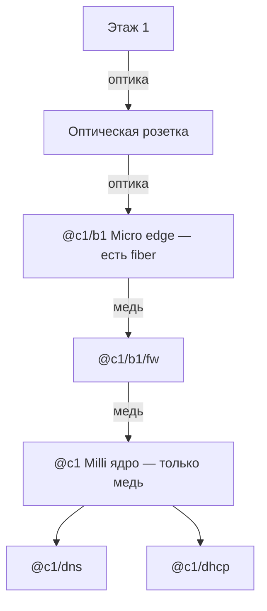

# Newbie — Lab Mode

Tower Networking Inc. Песочница для обучения сети.

## Пресет Lab Mode

| Опция | Значение |
|-------|----------|
| Свободная игра | **Вкл** |
| Start with all tech enabled | **Вкл** |
| Infinite money | **Вкл** |
| Бесплатное электричество | Выкл |
| Автосоздание DNS-записей | **Выкл** |
| Подсказки по подключению | Выкл |
| Видеть ошибки/подсказки в мире | **Вкл** |
| Устройства имеют бесконечную пропускную способность | **Выкл** (реальная ПС) |
| Отладчику нужна свободная пропускная способность | Выкл |
| Столкновение устройств при перемещении | Выкл |
| Локальные DNS записи | **Вкл** |
| Автозапуск установленных программ | **Выкл** |
| Для запросов нужны сетевые адреса | **Вкл** |
| Default user DHCP mode | **Выкл** |
| Default device DHCP mode | **Выкл** |
| DHCP skip routing on source | Выкл |

### Что это значит на практике

- Деньги и дерево технологий не мешают — учишь **маршруты / DNS / DHCP / FW**.
- DNS и DHCP **руками**: нет авто-записей и default DHCP.
- Запросам нужны **сетевые адреса** → без рабочего DNS/имён трафик не пойдёт.
- ПС реальная — линки переполняются.
- После `program install` сервис может лежать — нужен `program start`.
- Электричество платное.

---

## ИТОГО: ЦОД сразу под оптику (без переделки розеток)

По таблицам железа ([hackmd device-tables](https://hackmd.io/@tower-network/device-tables), сверяй также [tni-unofficial-docs](https://avril112113.github.io/tni-unofficial-docs/)):

| Роутер | Медь | Оптика |
|--------|------|--------|
| **Disco Milli** | 8 | **0** |
| **Disco Micro** | 5 | **5** |

Значит **оптику с этажа принимает Micro**, не Milli. Milli — наоборот удобен как **ядро** (много меди под DNS/DHCP/FW/debugger).

### Имена: это ЦОД, не этажи

`b1` = **блок 1** (группа этажей), а не «первый этаж». Edge блока стоит **в ЦОД**:

| Имя | Где физически | Что это |
|-----|---------------|---------|
| `@c1` | ЦОД | Ядро (Milli) |
| `@c1/b1` | **ЦОД** | Edge **блока** 1 (Micro) — сюда TL с низа блока |
| `@c1/b1/fw` | **ЦОД** | FW между edge и ядром |
| `@c1/dns`, `@c1/dhcp` | ЦОД | Серверы |
| `@c1/b1/f1` | стойка «этаж 1» | Роутер **этажа** — **позже** |
| `@c1/b1/f2` | стойка «этаж 2» | Роутер этажа 2 — **позже** |

Пока настраиваем только ЦОД — используем `@c1`, `@c1/b1`, `@c1/b1/fw`. Префикс `…/f1` появится, когда соберёшь среднюю стойку.

### Роли

| # | Что | Модель | Имя | Роль |
|---|-----|--------|-----|------|
| 1 | Роутер **edge** | Disco **Micro** (уже есть) | `@c1/b1` | Сюда **оптика** с этажа |
| 2 | Роутер **ядро** | Disco **Milli** (есть) | `@c1` | DNS/DHCP |
| 3 | Firewall | **FW-24e** (уже есть) | `@c1/b1/fw` | **Медь** между Micro и Milli |
| 4–5 | DNS / DHCP | Boulder+ ×2 | `@c1/dns`, `@c1/dhcp` | к **Milli** красным |
| 6 | Питание | Tenabolt + Ultrabolt | — | — |
| 7 | Розетка | **Fiber** | — | этаж ↔ ЦОД |
| — | Debugger | — | `@me` | к **Micro** port4 (ок на edge; на Milli переносить не обязательно) |

### Провода

```text
этаж 1 ══оптика TL══► розетка ══оптика══► @c1/b1 Micro port9
                                              │ медь (ещё не)
                                           @c1/b1/fw
                                              │ медь
                                           @c1 Milli
                                              ├── красный → @c1/dns
                                              └── красный → @c1/dhcp
Debugger ──фиолет──► Micro port4
```

### Порты Micro `@c1/b1` (факт)

| Port | Куда |
|------|------|
| **0** | → `@c1/b1/fw` port**0** (медь) |
| **4** | Debugger |
| **9** | Оптическая розетка → этаж 1 (Tower Link) |

### Порты FW `@c1/b1/fw` (факт)

| Port | Куда |
|------|------|
| **0** | ← Micro port0 |
| **1** | → Milli `@c1` port**0** |

### Порты Milli `@c1` (факт)

| Port | Куда |
|------|------|
| **0** | ← FW port1 |
| **1** | → `@c1/dns` port**0** (красный) |
| **2** | → `@c1/dhcp` port**0** (красный) |



Позже больше блоков: ещё optical-розетки на **другие fiber-порты Micro** (их 5). Когда портов не хватит — второй Micro / Spine / Beam, не Milli.

### Порядок сейчас

1. ~~Оптика на Micro port9~~ · ~~Debugger на Micro port4~~ · ~~Micro:0→FW:0~~ · ~~Milli запитан~~.  
2. FW port1 → Milli; красные Milli → DNS/DHCP.  
3. Имена + программы + `fcmal`.  
4. На этаже 1 — парная optical + Tower Link.

---

## Тестовая настройка (Lab) — контекст

На экране **три пустые стойки**. Слева направо — это **не** три этажа башни, а сокращённая схема «ЦОД + блок из 2 этажей» (без f3).

| Стойка (слева →) | Роль | Имена сейчас |
|------------------|------|--------------|
| **1 (лево)** | **ЦОД** | `@c1` (ядро), `@c1/b1` (edge блока), `@c1/b1/fw`, dns/dhcp |
| **2 (середина)** | **Этаж 1** блока | позже `@c1/b1/f1/…` |
| **3 (право)** | **Этаж 2** блока | позже `@c1/b1/f2/…` |

```text
[ стойка ЦОД ]              [ этаж 1 ]           [ этаж 2 ]
  Milli @c1                   @c1/b1/f1            @c1/b1/f2
  Micro @c1/b1 ←══оптика TL══─┘
```

### Что кладём куда (цель теста)

| Стойка | Железо (минимум на старт) | Программы |
|--------|--------------------------|-----------|
| **ЦОД** | **Micro=edge** (оптика) + **Milli=ядро** + FW + DNS/DHCP | dns-server + padu; dnsmasq |
| **Этаж 1** | (позже) Blade, роутер, FW, DNS+DHCP блока | dns-lite; dnsmasq |
| **Этаж 2** | (позже) Blade, роутер, FW, DNS | dns-lite |

Линки:

1. Этаж 1 **down** → через `f1/fw` → TL → `@c1/b1` (в стойке ЦОД).  
2. Этаж 2 **down** → через `f2/fw` → TL → **up** этажа 1.  
3. У этажа 2 **нет** up дальше (в полном гайде тут был бы f3).

Имена и ПО как в [`tni-day1-starter.md`](./tni-day1-starter.md), только блок урезан до **2 этажей**.

### Статус

- [x] Пресет Lab  
- [x] Три стойки назначены (ЦОД / f1 / f2)  
- [x] В ЦОД: Micro, **Milli**, FW-24e, Boulder+ ×2, Tenabolt, Ultrabolt  
- [x] Micro port**9** → optical; port**4** → Debugger; port**0** → FW port**0**  
- [x] **Disco Milli** запитан; FW:1→Milli:0; Milli:1→DNS:0; Milli:2→DHCP:0  
- [ ] Имена + программы + `fcmal` + маршруты  
- [ ] Железо на этажах + TL  
- [ ] ping / trace  

### Факт со стойки ЦОД (со скрина)

| Железо | Как в мире | Имя (назначить) |
|--------|------------|-----------------|
| Disco **Micro** | edge под оптику | `@c1/b1` |
| Disco **Milli** | ядро, запитан | `@c1` |
| **FW-24e** | медь Micro↔Milli | `@c1/b1/fw` |
| **Ultrabolt EX6** | разветвитель питания | — |
| **Boulder+** ×2 | внизу, оба горят | `@c1/dns`, `@c1/dhcp` |
| **Tenabolt** 800 W | сверху, Load ~551 W | — |
| Debugger | рядом с ИБП | `@me` |

На Micro сетевые порты **пока свободны** — «занятые» на скрине были **провода питания**, не Ethernet.  
Этажи 2–3: Tenabolt + Ultrabolt пока **без** роутеров — ок, не трогаем.

### Следующий шаг

1. Купить **Disco Milli** = ядро `@c1`.  
2. Micro = edge `@c1/b1` (оптика с этажа).  
3. Розетки **optical**.  
4. Патч + имена + программы.

---

## Стойка ЦОД — старт (минимум)

Канон — блок **[ИТОГО](#итого-цод-сразу-под-оптику-без-переделки-розеток)** выше. Здесь то же самое кратко.

Для старта ЦОД **не** нужны money (voip/git) и svc. **Нужны два роутера**, иначе оптика и медный FW не живут вместе.

| # | Что | Модель | Имя | Зачем |
|---|-----|--------|-----|--------|
| 1 | Роутер **edge** | **Disco Micro** (есть) | `@c1/b1` | **5× fiber** — оптика с этажа |
| 2 | Роутер **ядро** | **Disco Milli** (купить) | `@c1` | **8× медь** — DNS, DHCP, debugger, FW |
| 3 | **ИБП** | Tenabolt 800 W | — | питание |
| 4 | **Разветвитель** | Ultrabolt EX6 | — | розетки в стойке |
| 5 | **Firewall** | FW-24e | `@c1/b1/fw` | медь Micro ↔ Milli; `fcmal` |
| 6 | **DNS** | Boulder+ | `@c1/dns` | к Milli · dns-server + padu_v1 |
| 7 | **DHCP** | Boulder+ | `@c1/dhcp` | к Milli · dnsmasq |
| 8 | Розетка | **Fiber** | — | этаж ↔ ЦОД |

**Почему так**

| Роль | Бери | Почему |
|------|------|--------|
| Edge | **Micro** | У Milli **нет** оптики; у Micro — 5 fiber |
| Ядро | **Milli** | Больше медных портов под серверы |
| FW | **FW-24e** | Только медь → между edge и ядром, **не** в optical hop |
| DNS/DHCP | **Boulder+** ×2 | Отдельно; dns-server нужен padu |

В руках: **Debugger** + **Datawiper**. Позже: voip/git, svc — не сейчас.

### Программы

| Сервер | Install + start |
|--------|-----------------|
| `@c1/dns` | `padu_v1`, `dns-server` |
| `@c1/dhcp` | `dnsmasq` → `dhprefix @c1/`, `dhdns @c1/dns` |

```text
pip1 @c1/dns
pidns2 @c1/dns
program start padu_v1 on @c1/dns
program start dns-server on @c1/dns
pidhcp1 @c1/dhcp
program start dnsmasq on @c1/dhcp
dhprefix @c1/ @c1/dhcp
dhdns @c1/dns @c1/dhcp
fcmal @c1/b1/fw
```

### Схема проводов (цвета)

| Цвет / среда | Куда |
|--------------|------|
| **Оптика** | этаж ↔ розетка ↔ **Micro port9** |
| **Оранжевый/жёлтый медь** | Micro → **FW** → Milli |
| **Красный** | Milli → DNS, Milli → DHCP |
| **Фиолетовый** | Debugger → **Micro port4** |
| Питание | Tenabolt / Ultrabolt — не Ethernet |

```text
этаж ══оптика══► розетка ══оптика══► @c1/b1 Micro :9
                                         │ медь
                                      @c1/b1/fw
                                         │ медь
                                      @c1 Milli
                                         ├── красный → @c1/dns
                                         └── красный → @c1/dhcp
Debugger ──фиолет──► Micro :4
```

Таблица патча:

| # | Среда | От | Port | К | Port | Статус |
|---|-------|----|------|---|------|--------|
| 1 | Оптика | розетка этажа | — | `@c1/b1` Micro | **9** | **есть** |
| 2 | Фиолетовый | Debugger | — | `@c1/b1` Micro | **4** | **есть** |
| 3 | Медь | `@c1/b1` Micro | **0** | `@c1/b1/fw` | **0** | **есть** |
| 4 | Медь | `@c1/b1/fw` | **1** | `@c1` Milli | **0** | **есть** |
| 5 | Красный | `@c1` Milli | **1** | `@c1/dns` | **0** | **есть** |
| 6 | Красный | `@c1` Milli | **2** | `@c1/dhcp` | **0** | **есть** |

### Порядок сейчас

1. ~~Весь патч ЦОД~~ (optical9, dbg4, Micro0→FW0→FW1→Milli0, Milli1→DNS, Milli2→DHCP).  
2. **Сейчас:** netshell — имена, `rca`, программы, `fcmal`.  
3. Этажи — потом.

### Следующий шаг — netshell (имена + routes + ПО)

FW прозрачен (как свитч). Маршруты только на роутерах:

```text
ncall @c1 @c1/dns HW
ncall @c1/b1 @c1/dns HW
ncall @c1/b1/fw @c1/dns HW
ncall @c1/dns @c1/dns HW_DNS
ncall @c1/dhcp @c1/dns HW_DHCP

rca @c1/b1 0 @c1
rca @c1/dns 1 @c1
rca @c1/dhcp 2 @c1
rca @c1 0 @c1/b1

pip1 @c1/dns
pidns2 @c1/dns
program start padu_v1 on @c1/dns
program start dns-server on @c1/dns
pidhcp1 @c1/dhcp
program start dnsmasq on @c1/dhcp
dhprefix @c1/ @c1/dhcp
dhdns @c1/dns @c1/dhcp
fcmal @c1/b1/fw
```

На Micro позже: `rca` на port9 к этажу, когда будет TL.  
Если `ncall` ругается до DNS — сначала install/start, потом имена.

> Старые варианты «один Micro + медь» / «FW в стороне» **отменены** — не используй.

---

Связанные файлы:

- день 1 пошагово: [`tni-day1-starter.md`](./tni-day1-starter.md)
- справочник: [`tni-floor-connectivity.md`](./tni-floor-connectivity.md)
- алиасы: [`alias-pack.txt`](./alias-pack.txt)

### Внешние справочники (железо / данные игры)

- [tni-unofficial-docs](https://avril112113.github.io/tni-unofficial-docs/) ([репо](https://github.com/Avril112113/tni-unofficial-docs)) — сгенерированные таблицы устройств, raw-данные; часто с **beta**, на stable могут отличаться
- [hackmd device-tables](https://hackmd.io/@tower-network/device-tables) — краткая сводка портов/ватт
- Steam: [Hitchhiker](https://steamcommunity.com/sharedfiles/filedetails/?id=3651464033), [Firewalls](https://steamcommunity.com/sharedfiles/filedetails/?id=3548511586)
