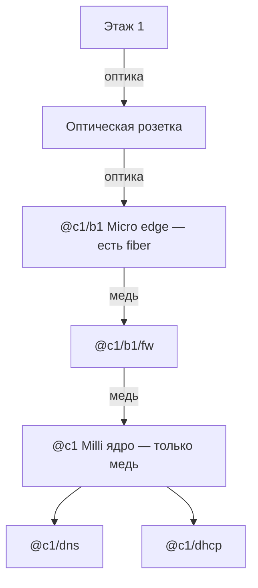

# Newbie — Lab Mode

Tower Networking Inc. Песочница для обучения сети.

## Пресет Lab Mode


| Опция                                               | Значение               |
| --------------------------------------------------- | ---------------------- |
| Свободная игра                                      | **Вкл**                |
| Start with all tech enabled                         | **Вкл**                |
| Infinite money                                      | **Вкл**                |
| Бесплатное электричество                            | Выкл                   |
| Автосоздание DNS-записей                            | **Выкл**               |
| Подсказки по подключению                            | Выкл                   |
| Видеть ошибки/подсказки в мире                      | **Вкл**                |
| Устройства имеют бесконечную пропускную способность | **Выкл** (реальная ПС) |
| Отладчику нужна свободная пропускная способность    | Выкл                   |
| Столкновение устройств при перемещении              | Выкл                   |
| Локальные DNS записи                                | **Вкл**                |
| Автозапуск установленных программ                   | **Выкл**               |
| Для запросов нужны сетевые адреса                   | **Вкл**                |
| Default user DHCP mode                              | **Выкл**               |
| Default device DHCP mode                            | **Выкл**               |
| DHCP skip routing on source                         | Выкл                   |


### Что это значит на практике

- Деньги и дерево технологий не мешают — учишь **маршруты / DNS / DHCP / FW**.
- DNS и DHCP **руками**: нет авто-записей и default DHCP.
- Запросам нужны **сетевые адреса** → без рабочего DNS/имён трафик не пойдёт.
- ПС реальная — линки переполняются.
- После `program install` сервис может лежать — нужен `program start`.
- Электричество платное.

---

## ИТОГО: ЦОД сразу под оптику (без переделки розеток)

По таблицам железа ([hackmd device-tables](https://hackmd.io/@tower-network/device-tables), сверяй также [tni-unofficial-docs](https://avril112113.github.io/tni-unofficial-docs/)):


| Роутер          | Медь | Оптика |
| --------------- | ---- | ------ |
| **Disco Milli** | 8    | **0**  |
| **Disco Micro** | 5    | **5**  |


Значит **оптику с этажа принимает Micro**, не Milli. Milli — наоборот удобен как **ядро** (много меди под DNS/DHCP/FW/debugger).

### Имена: это ЦОД, не этажи

`b1` = **блок 1** (группа этажей), а не «первый этаж». Edge блока стоит **в ЦОД**:


| Имя                   | Где физически   | Что это                                         |
| --------------------- | --------------- | ----------------------------------------------- |
| `@c1`                 | ЦОД             | Ядро (Milli)                                    |
| `@c1/b1`              | **ЦОД**         | Edge **блока** 1 (Micro) — сюда TL с низа блока |
| `@c1/b1/fw`           | **ЦОД**         | FW между edge и ядром                           |
| `@c1/dns`, `@c1/dhcp` | ЦОД             | Серверы                                         |
| `@c1/b1/f1`           | стойка «этаж 1» | Роутер **этажа** — **позже**                    |
| `@c1/b1/f2`           | стойка «этаж 2» | Роутер этажа 2 — **позже**                      |


Пока настраиваем ЦОД + этаж 1: `@c1`, `@c1/b1`, `@c1/b1/f1/…`. Префикс этажа — **`@c1/b1/f1`** (DNS/DHCP/clients/producers этажа), не `@c1/b1`.

### Роли


| #   | Что             | Модель                     | Имя                   | Роль                                                  |
| --- | --------------- | -------------------------- | --------------------- | ----------------------------------------------------- |
| 1   | Роутер **edge** | Disco **Micro** (уже есть) | `@c1/b1`              | Сюда **оптика** с этажа                               |
| 2   | Роутер **ядро** | Disco **Milli** (есть)     | `@c1`                 | DNS/DHCP                                              |
| 3   | Firewall        | **FW-24e** (уже есть)      | `@c1/b1/fw`           | **Медь** между Micro и Milli                          |
| 4–5 | DNS / DHCP      | Boulder+ ×2                | `@c1/dns`, `@c1/dhcp` | к **Milli** красным                                   |
| 6   | Питание         | Tenabolt + Ultrabolt       | —                     | —                                                     |
| 7   | Розетка         | **Fiber**                  | —                     | этаж ↔ ЦОД                                            |
| —   | Debugger        | —                          | `@debug`              | на **Milli** для `init_dc` (исторически был Micro :4) |


### Провода

```text
этаж 1 ══оптика TL══► розетка ══оптика══► @c1/b1 Micro port9
                                              │ медь (ещё не)
                                           @c1/b1/fw
                                              │ медь
                                           @c1 Milli
                                              ├── красный → @c1/dns
                                              └── красный → @c1/dhcp
Debugger ──фиолет──► Milli (для init_dc)
```

### Порты Micro `@c1/b1` (факт)


| Port  | Куда                                     |
| ----- | ---------------------------------------- |
| **0** | → `@c1/b1/fw` port**0** (медь)           |
| **9** | Оптическая розетка → этаж 1 (Tower Link) |
| медь свободная | Debugger на edge (опц.; для `init_dc` лучше Milli) |


### Порты FW `@c1/b1/fw` (факт)


| Port  | Куда                    |
| ----- | ----------------------- |
| **0** | ← Micro port0           |
| **1** | → Milli `@c1` port**0** |


### Порты Milli `@c1` (факт)


| Port   | Куда                                        |
| ------ | ------------------------------------------- |
| **0**  | ← FW port1                                  |
| **1**  | → `@c1/dns` port**0** (красный)             |
| **2**  | → `@c1/dhcp` port**0** (красный)            |
| **3?** | Debugger (если переткнул сюда для разведки) |


HW: Micro **43060**, FW **10054**, Milli **85182**, Debugger **98662**.




Позже больше блоков: ещё optical-розетки на **другие fiber-порты Micro** (их 5). Когда портов не хватит — второй Micro / Spine / Beam, не Milli.

### Порядок сейчас

1. ~~ЦОД: патч + `adebug` + `init_dc`~~  
2. ~~Этаж 1: патч + `init_f1` + оптика + `ripup` + клиенты/`p-mail`~~  
3. Этаж 2 — потом.

---

## Канон прогона Lab (чеклист одной страницей)

Порядок, которым реально собрали сейв:

```text
# 0. Алиасы (adebug, init_dc, init_f1, ripup, dhup, dhprod) — из alias-pack / ниже
# 1. ЦОД: патч → debugger на Milli
adebug 98662
init_dc 85182 2 1 0 26997 57440 10054 43060 c1
# PREFIX без @: c1 → имена @$9 (= @c1/…)

# 2. Этаж 1: медь + TL розеток (оптику на Micro f1 — после init или сразу)
#    Debugger на Micro f1
init_f1 7209 2 1 0 9124 35304 56171 21731 c1/b1/f1
# PREFIX без @: c1/b1/f1 → @$9/dns, @$9/u-, @$9/p-, …

# 3. Оптика Micro f1 :9 → розетка (если ещё не)
# 4. Uplink — RIP на трёх роутерах (не ручной default, если RIP есть)
ripup @c1/b1/f1
ripup @c1/b1
ripup @c1
ping @c1/dns

# 5. Клиенты: debugger → Blade
scan u
dhup HW          # boot + request; Lab default DHCP = выкл
# route u-/p- уже из init_f1; иначе:
# route add @c1/b1/f1/u- via port0 on @c1/b1/f1
# route add @c1/b1/f1/p- via port0 on @c1/b1/f1

# 6. Producer (mail-hub): имя под p-, не u-
dhprod 55808 @c1/b1/f1/p-mail @c1/b1/f1/dhcp
# dhprod с Blade; с Micro за FW — timeout на request
ping @c1/b1/f1/p-mail
```

### Грабли (обязательно помнить)

| Грабль | Суть |
|--------|------|
| PREFIX в `init_*` | Аргумент **без** `@` (`c1`, `c1/b1/f1`); в алиасе имена через `@$9` |
| `dhcp option prefix` в логе | Часто показывает `c1/…/u-` **без** `@` — норма игры |
| RIP | Только **разносит** уже существующие routes; DHCP-имя само в таблицу не попадает |
| `u-` / `p-` | Локальные prefix-routes на port FW; иначе default drop |
| Producer ≠ `u-` | `@…/p-mail`, не `@…/mail` и не случайный `u-` |
| `dhup` / `dhprod` request | Дебаггер на **Blade**; с Micro timeout |
| `scan u` | Юзеры + часть producers; спящие не видны; с роутера часто пусто |
| `scan devices` | tcp/23 — клиенты обычно не светятся |
| `dhcp show` | В основном **bind’ы**; динамические лизы смотри в `scan u` |
| Переименование bind | `dhcp option unbind HW` → новый `dhprod` → `dhup`/`request` с Blade |

---

## Тестовая настройка (Lab) — контекст

На экране **три пустые стойки**. Слева направо — это **не** три этажа башни, а сокращённая схема «ЦОД + блок из 2 этажей» (без f3).


| Стойка (слева →) | Роль             | Имена сейчас                                               |
| ---------------- | ---------------- | ---------------------------------------------------------- |
| **1 (лево)**     | **ЦОД**          | `@c1` (ядро), `@c1/b1` (edge блока), `@c1/b1/fw`, dns/dhcp |
| **2 (середина)** | **Этаж 1** блока | `@c1/b1/f1/…`, dns/dhcp, `u-`/`p-` |
| **3 (право)**    | **Этаж 2** блока | позже `@c1/b1/f2/…`                                        |


```text
[ стойка ЦОД ]              [ этаж 1 ]           [ этаж 2 ]
  Milli @c1                   @c1/b1/f1            @c1/b1/f2
  Micro @c1/b1 ←══оптика TL══─┘
```

### Что кладём куда (цель теста)


| Стойка     | Железо (минимум на старт)                                | Программы                               |
| ---------- | -------------------------------------------------------- | --------------------------------------- |
| **ЦОД**    | **Micro=edge** (оптика) + **Milli=ядро** + FW + DNS/DHCP | dns-server + padu; dnsmasq              |
| **Этаж 1** | **Micro** + Blade5 + FW-24e + Boulder+×2 (+ питание)     | dns-lite; dnsmasq · имена `@c1/b1/f1/…` |
| **Этаж 2** | (позже) Blade, роутер, FW, DNS                           | dns-lite                                |


Линки:

1. Этаж 1 **down** → **fiber** с `@c1/b1/f1` → TL → `@c1/b1` Micro port9 (этажный FW **не** в optical hop).
2. Этаж 2 **down** → через `f2/fw` → TL → **up** этажа 1 — позже.
3. У этажа 2 **нет** up дальше (в полном гайде тут был бы f3).

Имена и ПО как в `[tni-day1-starter.md](./tni-day1-starter.md)`, только блок урезан до **2 этажей**.

### Статус

- [x] Пресет Lab  
- [x] Три стойки назначены (ЦОД / f1 / f2)  
- [x] В ЦОД: Micro, **Milli**, FW-24e, Boulder+ ×2, Tenabolt, Ultrabolt  
- [x] Micro port**9** → optical; port**0** → FW; Debugger на **Milli**  
- [x] Патч ЦОД + `@debug` (HW 98662, `always using`)  
- [x] `init_dc` — ядро + edge (имена, DNS/DHCP, routes, fcmal)  
- [x] `init_f1` — имена `@c1/b1/f1/…`, dns-lite, dnsmasq, routes, Morris-deny  
- [x] Оптика Micro f1 → розетка  
- [x] `ripup` на `@c1/b1/f1`, `@c1/b1`, `@c1` — ping ЦОД OK  
- [x] Клиенты на Blade: `scan u` + `dhup` → `@c1/b1/f1/u-…`  
- [x] mail-hub: `@c1/b1/f1/p-mail` + route `p-` · ping OK  
- [ ] Этаж 2 / DNS map продюсера / money  

### Клиенты — DHCP (Lab) — факт прогона

Пресет: Default user/device DHCP = **Выкл** → клиент **сам** адрес не просит.

#### До клиентов на роутере

```text
route add @c1/b1/f1/u- via port0 on @c1/b1/f1
route add @c1/b1/f1/p- via port0 on @c1/b1/f1
```

Без `u-` / `p-` ответы на клиентов и продюсеров дропаются (default drop). В свежем `init_f1`: оба `route add @$9/u-` и `@$9/p-` via port FW.

| Префикс | Кто | Пример |
|---------|-----|--------|
| `@c1/b1/f1/u-…` | consumers (DHCP prefix) | авто из dnsmasq |
| `@c1/b1/f1/p-…` | producers (`dhprod`) | `@c1/b1/f1/p-mail` |

Префикс DHCP в логе часто **без** `@` (`c1/b1/f1/u-`); в `scan u` у клиентов всё равно `@c1/b1/f1/…`.

#### Где дебаггер


| Задача                   | Куда воткнуть                 |
| ------------------------ | ----------------------------- |
| `init_f1` / routes / RIP | Micro f1 (медь)               |
| `dhup` / `scan u`        | **Blade** (один L2 с юзерами) |


С Micro за FW: `dhup HW` → часто `connection timeout`.

#### Команды на клиенте


| Команда                          | Смысл                        |
| -------------------------------- | ---------------------------- |
| `net dhcp boot on HW`            | DHCP при (пере)запуске       |
| `net dhcp periodic on HW`        | периодический renew          |
| `net dhcp request on HW`         | принудительный запрос сейчас |
| `net dhcp disable on HW`         | выкл (статика / `nca`)       |
| `dhcp option lease SEC on @dhcp` | период с стороны сервера     |


Единый алиас:

```text
alias dhup echo usage: dhup DEVICE_HW; net dhcp boot on $1; net dhcp request on $1
```

Также в pack: `dhboot`, `dhper`, `dhreq`, **`dhprod`** (продюсеры под `p-`).

#### Порядок

1. Синий: **consumer** → Blade. Зелёный: **producer** (mail-hub, cam…) → Blade.
  Спящий в `scan u` **не** виден. `scan u` показывает и юзеров, и часть продюсеров — смотри тип в мире / Surveyor.
2. Дебаггер → Blade, `adebug 98662`.
3. `scan u` — HW + `unassign` / адрес (не путать с `scan devices`).
4. Consumers: `dhup HW`.
5. Producers: `dhprod HW @…/p-NAME DHCP` — всегда под префикс `p-`.  
6. Снова `scan u`. `dhcp show` — в основном bind’ы; лизы клиентов часто только в `scan u`.

#### Этот сейв — consumers


| USER               | HW        | После dhup                   |
| ------------------ | --------- | ---------------------------- |
| icky-opossum       | **7950**  | `@c1/b1/f1/…`                |
| clear-scorpion     | **8268**  | `@c1/b1/f1/…`                |
| mortified-seahorse | **94692** | `@c1/b1/f1/…` (сначала спал) |


#### Этот сейв — mail-hub (producer)


| Устройство                   | HW        | Имя                 |
| ---------------------------- | --------- | ------------------- |
| detailed-reindeer (mail-hub) | **55808** | `@c1/b1/f1/p-mail` |


```text
alias dhprod echo usage: dhprod HW NETADDR DHCP - example dhprod 55808 @c1/b1/f1/p-mail @c1/b1/f1/dhcp; dhcp option bind $1 as $2 on $3; net dhcp boot on $1; net dhcp request on $1
route add @c1/b1/f1/p- via port0 on @c1/b1/f1
dhcp option unbind 55808 on @c1/b1/f1/dhcp
dhprod 55808 @c1/b1/f1/p-mail @c1/b1/f1/dhcp
ping @c1/b1/f1/p-mail
```

`dhprod` = только bind + DHCP. Один route **`p-`** накрывает всех продюсеров этажа (как `u-` — клиентов).

DNS map Surveyor → `@c1/b1/f1/p-mail` — позже (PPU).

```text
scan u
dhup 7950
dhup 8268
dhup 94692
scan u
ping @c1/dns from 7950
```

### Следующий шаг

1. ~~Клиенты f1 + DHCP~~.
2. Этаж 2.
3. (опц.) money / Registry.

### Факт со стойки ЦОД (со скрина)


| Железо             | Как в мире           | Имя (назначить)       |
| ------------------ | -------------------- | --------------------- |
| Disco **Micro**    | edge под оптику      | `@c1/b1`              |
| Disco **Milli**    | ядро, запитан        | `@c1`                 |
| **FW-24e**         | медь Micro↔Milli     | `@c1/b1/fw`           |
| **Ultrabolt EX6**  | разветвитель питания | —                     |
| **Boulder+** ×2    | внизу, оба горят     | `@c1/dns`, `@c1/dhcp` |
| **Tenabolt** 800 W | сверху, Load ~551 W  | —                     |
| Debugger           | рядом с ИБП          | `@debug`              |


### Факт — стойка этаж 1 (средняя)


| Железо                 | HW        | Имя (назначить)  |
| ---------------------- | --------- | ---------------- |
| Debugger               | **98662** | `@debug` (уже)   |
| Disco **Micro**        | **7209**  | `@c1/b1/f1`      |
| **FW-24e** / FireWatch | **56171** | `@c1/b1/f1/fw`   |
| **Blade5**             | **21731** | `@c1/b1/f1/s1`   |
| **Boulder+** DNS       | **35304** | `@c1/b1/f1/dns`  |
| **Boulder+** DHCP      | **9124**  | `@c1/b1/f1/dhcp` |
| Tenabolt / Ultrabolt   | —         | питание          |


`scan` с дебаггера на f1: Micro hop1, FW hop2, Blade hop3. DNS/DHCP HW кликом.

**Патч медь (факт):**


| От               | Port  | К        | Port  |
| ---------------- | ----- | -------- | ----- |
| `@c1/b1/f1/dns`  | **0** | Micro f1 | **1** |
| `@c1/b1/f1/dhcp` | **0** | Micro f1 | **2** |
| FW               | **0** | Micro f1 | **0** |
| Blade            | **0** | FW       | **1** |


Цепочка клиентов: `Blade :0 → FW :1 · FW :0 → Micro :0`.  
Оптика Micro f1 → розетка — **есть**; TL + RIP на ЦОД — **есть**.  
Debugger: для init — Micro медь **3/4**; для клиентов — **Blade**.

---

## Стойка ЦОД — старт (минимум)

Канон — блок **[ИТОГО](#итого-цод-сразу-под-оптику-без-переделки-розеток)** выше. Здесь то же самое кратко.

Для старта ЦОД **не** нужны money (voip/git) и svc. **Нужны два роутера**, иначе оптика и медный FW не живут вместе.


| #   | Что              | Модель                   | Имя         | Зачем                                 |
| --- | ---------------- | ------------------------ | ----------- | ------------------------------------- |
| 1   | Роутер **edge**  | **Disco Micro** (есть)   | `@c1/b1`    | **5× fiber** — оптика с этажа         |
| 2   | Роутер **ядро**  | **Disco Milli** (купить) | `@c1`       | **8× медь** — DNS, DHCP, debugger, FW |
| 3   | **ИБП**          | Tenabolt 800 W           | —           | питание                               |
| 4   | **Разветвитель** | Ultrabolt EX6            | —           | розетки в стойке                      |
| 5   | **Firewall**     | FW-24e                   | `@c1/b1/fw` | медь Micro ↔ Milli; `fcmal`           |
| 6   | **DNS**          | Boulder+                 | `@c1/dns`   | к Milli · dns-server + padu_v1        |
| 7   | **DHCP**         | Boulder+                 | `@c1/dhcp`  | к Milli · dnsmasq                     |
| 8   | Розетка          | **Fiber**                | —           | этаж ↔ ЦОД                            |


**Почему так**


| Роль     | Бери            | Почему                                                 |
| -------- | --------------- | ------------------------------------------------------ |
| Edge     | **Micro**       | У Milli **нет** оптики; у Micro — 5 fiber              |
| Ядро     | **Milli**       | Больше медных портов под серверы                       |
| FW       | **FW-24e**      | Только медь → между edge и ядром, **не** в optical hop |
| DNS/DHCP | **Boulder+** ×2 | Отдельно; dns-server нужен padu                        |


В руках: **Debugger** + **Datawiper**. Позже: voip/git, svc — не сейчас.

### Программы

Всё это делает `**init_dc**` — вручную не нужно. Для справки:


| Сервер      | Install + start               |
| ----------- | ----------------------------- |
| `@c1/dns`   | `padu_v1`, `dns-server`       |
| `@c1/dhcp`  | `dnsmasq` + bind/prefix/dns   |
| `@c1/b1/fw` | Morris/scraper deny (`fcmal`) |


### Схема проводов (цвета)


| Цвет / среда              | Куда                                               |
| ------------------------- | -------------------------------------------------- |
| **Оптика**                | этаж ↔ розетка ↔ **Micro port9**                   |
| **Оранжевый/жёлтый медь** | Micro → **FW** → Milli                             |
| **Красный**               | Milli → DNS, Milli → DHCP                          |
| **Фиолетовый**            | Debugger → **Milli** (для `init_dc`; был Micro :4) |
| Питание                   | Tenabolt / Ultrabolt — не Ethernet                 |


```text
этаж ══оптика══► розетка ══оптика══► @c1/b1 Micro :9
                                         │ медь
                                      @c1/b1/fw
                                         │ медь
                                      @c1 Milli
                                         ├── красный → @c1/dns
                                         └── красный → @c1/dhcp
Debugger ──фиолет──► Milli (для init_dc)
```

Таблица патча:


| #   | Среда      | От             | Port  | К              | Port            | Статус         |
| --- | ---------- | -------------- | ----- | -------------- | --------------- | -------------- |
| 1   | Оптика     | розетка этажа  | —     | `@c1/b1` Micro | **9**           | **есть**       |
| 2   | Фиолетовый | Debugger       | —     | `@c1` Milli    | любой свободный | **переткнуть** |
| 3   | Медь       | `@c1/b1` Micro | **0** | `@c1/b1/fw`    | **0**           | **есть**       |
| 4   | Медь       | `@c1/b1/fw`    | **1** | `@c1` Milli    | **0**           | **есть**       |
| 5   | Красный    | `@c1` Milli    | **1** | `@c1/dns`      | **0**           | **есть**       |
| 6   | Красный    | `@c1` Milli    | **2** | `@c1/dhcp`     | **0**           | **есть**       |


### Порядок сейчас

1. ~~Патч ЦОД~~ · ~~`adebug` + `init_dc`~~.  
2. ~~Этаж 1~~ (см. [канон прогона](#канон-прогона-lab-чеклист-одной-страницей)).  
3. Этаж 2 — потом.

### Netshell — канон после патча

Стойка собрана и кабели вставлены → дальше только:

1. `adebug HW` (дебаггер на **Milli**)
2. `init_dc …` — одной командой имена, DNS/DHCP, routes, Morris-deny на FW

`ncall` / `nca` **не нужны** (есть в `alias-pack` на разовые правки). Поштучные `rca` / `pip1` / `fcmal` тоже не копируй вручную — это уже внутри `init_dc`.

#### 1. Дебаггер = `@debug`

В usage алиаса **нельзя** `[…]` — скобки ломают текст (`[lb]`/`[rb]`).

```text
alias adebug echo usage: adebug DEVICE_HW; net address set @debug on $1; net dhcp disable on $1; always using @debug
adebug 98662
```

#### 2. HW этого сейва (на новой игре — свои)


| Устройство | HW        | Имя         |
| ---------- | --------- | ----------- |
| Debugger   | **98662** | `@debug`    |
| Milli      | **85182** | `@c1`       |
| Micro      | **43060** | `@c1/b1`    |
| FW         | **10054** | `@c1/b1/fw` |
| DNS        | **57440** | `@c1/dns`   |
| DHCP       | **26997** | `@c1/dhcp`  |


#### 3. `init_dc`

Если `alias` уже показывает `adebug` и `init_dc` — **не переопределяй**, сразу вызывай. Ниже — тот же текст, что в игре / `[alias-pack.txt](./alias-pack.txt)` (на новую игру или другой сейв).

Аргументы: `HW_R PORT_DHCP PORT_DNS PORT_FW HW_DHCP HW_DNS HW_FW HW_MICRO PREFIX`


| $   | Смысл             | Пример |
| --- | ----------------- | ------ |
| $1  | HW Milli          | 85182  |
| $2  | порт → DHCP       | 2      |
| $3  | порт → DNS        | 1      |
| $4  | порт → FW         | 0      |
| $5  | HW DHCP           | 26997  |
| $6  | HW DNS            | 57440  |
| $7  | HW FW             | 10054  |
| $8  | HW Micro          | 43060  |
| $9  | префикс **без @** | c1     |


```text
alias init_dc echo usage: init_dc HW_R PORT_DHCP PORT_DNS PORT_FW HW_DHCP HW_DNS HW_FW HW_MICRO PREFIX - PREFIX without @ - example init_dc 85182 2 1 0 26997 57440 10054 43060 c1; route enable broadcast on $1; try ping $1 else echo fail router; route add traffic udp/53 via port$3 on $1; route add traffic udp/67 via port$2 on $1; route default via port$2 on $1; try ping $5 else echo fail dhcp; try program install dnsmasq on $5 else echo skip dhcp install; program start dnsmasq on $5; dhcp option bind $5 as @$9/dhcp on $5; dhcp option bind $6 as @$9/dns on $5; dhcp option bind $1 as @$9 on $5; dhcp option bind $7 as @$9/b1/fw on $5; dhcp option bind $8 as @$9/b1 on $5; dhcp option dns @$9/dns on $5; dhcp option prefix @$9/u- on $5; net dhcp request on $1; net dhcp request on $5; route default via port$3 on $1; try ping $6 else echo fail dns; net dhcp request on $6; try program install dns-server on $6 else echo skip dns; try program install padu_v1 on $6 else echo skip padu; program start dns-server on $6; program start padu_v1 on $6; route default via port$4 on $1; try ping $7 else echo fail fw; net dhcp request on $7; try ping $8 else echo fail micro; net dhcp request on $8; route default drop on $1; route add @$9/dns via port$3 on $1; route add @$9/dhcp via port$2 on $1; route add @$9/b1 via port$4 on $1; route add @$9 via port0 on $8; net dns set @$9/dns on $7; net dns set @$9/dns on $8; net dns set @$9/dns on @debug; firewall deny tcp/8034 on $7; firewall deny tcp/510 on $7; firewall deny tcp/511 on $7; firewall deny tcp/512 on $7; firewall deny tcp/513 on $7; firewall deny tcp/514 on $7; firewall deny tcp/515 on $7; firewall deny tcp/516 on $7; firewall deny tcp/517 on $7; firewall deny tcp/518 on $7; firewall deny tcp/519 on $7; route show on $1
```

Запуск (этот сейв):

```text
adebug 98662
init_dc 85182 2 1 0 26997 57440 10054 43060 c1
```

**Уже прогнано — успех.** PREFIX в алиасе теперь **без** `@` (`c1`), имена через `@$9` (иначе `dhcp option prefix $9/u-` съедает `@`).

Проверка: `ping @c1/dns` · `net show on @c1/b1` · `route show on @c1`.

Дальше — [этаж 1](#этаж-1--патч--netshell-факт) / [канон прогона](#канон-прогона-lab-чеклист-одной-страницей).

---

## Этаж 1 — патч + netshell (факт)

Железо + питание + медь + **оптика** + TL + `init_f1` + RIP + клиенты/`p-mail` — **готово**.

FW порты: **0→Micro**, **1←Blade**.

### Имена


| Железо        | Имя              |
| ------------- | ---------------- |
| Micro этажа   | `@c1/b1/f1`      |
| Blade5        | `@c1/b1/f1/s1`   |
| FW-24e        | `@c1/b1/f1/fw`   |
| Boulder+ DNS  | `@c1/b1/f1/dns`  |
| Boulder+ DHCP | `@c1/b1/f1/dhcp` |


### Провода — факт

```text
Клиенты ──► Blade :0 ──► FW :1
                           FW :0 ──► @c1/b1/f1 Micro :0
                                        ├── :1 ──красный──► @c1/b1/f1/dns :0
                                        └── :2 ──красный──► @c1/b1/f1/dhcp :0

fiber Micro f1 :9 ──► розетка этажа ══TL══► ЦОД Micro :9
```


| #   | Среда      | От            | Port  | К              | Port  | Статус   |
| --- | ---------- | ------------- | ----- | -------------- | ----- | -------- |
| 1   | Медь       | DNS           | **0** | Micro f1       | **1** | **есть** |
| 2   | Медь       | DHCP          | **0** | Micro f1       | **2** | **есть** |
| 3   | Медь       | FW            | **0** | Micro f1       | **0** | **есть** |
| 4   | Медь       | Blade         | **0** | FW             | **1** | **есть** |
| 5   | Tower Link | розетка этажа | —     | розетка ЦОД    | —     | **есть** |
| 6   | Оптика ЦОД | розетка ЦОД   | —     | `@c1/b1` Micro | **9** | **есть** |
| 7   | Оптика этаж | Micro f1      | **9** | розетка этажа  | —     | **есть** |


### Uplink в ЦОД — RIP (канон этого сейва)

Ручной `route default via port9` **не нужен**, если на всех роутерах RIP.

```text
alias ripup echo usage: ripup router; rip advertise on $1; rip listen on $1
ripup @c1/b1/f1
ripup @c1/b1
ripup @c1
```

**Прогон — успех.** На f1: `@c1`, `@c1/dns`, `@c1/dhcp` → port9; на edge/ядре — `@c1/b1/f1/…`.  
`ping @c1` · `ping @c1/dns` · `ping @c1/b1/f1/dns` — OK.

Локальные endpoint’ы (dns/dhcp/fw/s1/`u-`/`p-`) задаёт `init_f1` (+ `dhprod` для имён); mid-hop тянет RIP.  
RIP **не** создаёт route на `@…/p-mail` сам по себе — нужен prefix-route `p-` (или точечный).

Опционально без RIP: `route default via port9 on @c1/b1/f1` + `route add @c1/b1/f1 via port9 on @c1/b1`.

### Порядок сейчас (этаж 1)

1. ~~Патч~~ · ~~`init_f1`~~ · ~~оптика~~ · ~~`ripup`~~ · ~~клиенты / `p-mail`~~.  
2. Этаж 2 — потом.

### Netshell этажа — `init_f1` (справка)

```text
alias init_f1 echo usage: init_f1 HW_R PORT_DHCP PORT_DNS PORT_FW HW_DHCP HW_DNS HW_FW HW_BLADE PREFIX - PREFIX without @ - example init_f1 7209 2 1 0 9124 35304 56171 21731 c1/b1/f1; route enable broadcast on $1; try ping $1 else echo fail router; route add traffic udp/53 via port$3 on $1; route add traffic udp/67 via port$2 on $1; route default via port$2 on $1; try ping $5 else echo fail dhcp; try program install dnsmasq on $5 else echo skip dhcp install; program start dnsmasq on $5; dhcp option bind $5 as @$9/dhcp on $5; dhcp option bind $6 as @$9/dns on $5; dhcp option bind $1 as @$9 on $5; dhcp option bind $7 as @$9/fw on $5; dhcp option bind $8 as @$9/s1 on $5; dhcp option dns @$9/dns @c1/dns on $5; dhcp option prefix @$9/u- on $5; net dhcp request on $1; net dhcp request on $5; route default via port$3 on $1; try ping $6 else echo fail dns; net dhcp request on $6; try program install dns-lite on $6 else echo skip dns; program start dns-lite on $6; route default via port$4 on $1; try ping $7 else echo fail fw; net dhcp request on $7; try ping $8 else echo fail blade; net dhcp request on $8; route default drop on $1; route add @$9/dns via port$3 on $1; route add @$9/dhcp via port$2 on $1; route add @$9/fw via port$4 on $1; route add @$9/s1 via port$4 on $1; route add @$9/u- via port$4 on $1; route add @$9/p- via port$4 on $1; try net dns set @$9/dns on @$9/fw else echo skip dns fw; try net dns set @$9/dns on @$9/s1 else echo skip dns blade; try net dns set @$9/dns on @debug else echo skip dns debug; try firewall deny tcp/8034 on @$9/fw else echo skip fw; try firewall deny tcp/510 on @$9/fw else echo skip; try firewall deny tcp/511 on @$9/fw else echo skip; try firewall deny tcp/512 on @$9/fw else echo skip; try firewall deny tcp/513 on @$9/fw else echo skip; try firewall deny tcp/514 on @$9/fw else echo skip; try firewall deny tcp/515 on @$9/fw else echo skip; try firewall deny tcp/516 on @$9/fw else echo skip; try firewall deny tcp/517 on @$9/fw else echo skip; try firewall deny tcp/518 on @$9/fw else echo skip; try firewall deny tcp/519 on @$9/fw else echo skip; route show on $1
```

Запуск (этот сейв):

```text
init_f1 7209 2 1 0 9124 35304 56171 21731 c1/b1/f1
```


| $   | Смысл                   | Этот сейв |
| --- | ----------------------- | --------- |
| $1  | HW Micro f1             | 7209      |
| $2  | порт → DHCP             | 2         |
| $3  | порт → DNS              | 1         |
| $4  | порт → FW               | 0         |
| $5  | HW DHCP                 | 9124      |
| $6  | HW DNS                  | 35304     |
| $7  | HW FW                   | 56171     |
| $8  | HW Blade                | 21731     |
| $9  | префикс этажа **без @** | c1/b1/f1  |


Имена: `@$9` → `@c1/b1/f1`; DNS/DHCP/FW/Blade → `@$9/dns` и т.д. PREFIX в аргументе **без** `@`.

Проверка: `ping @c1/b1/f1/dns` · `route show on @c1/b1/f1` (должны быть `u-` и `p-` на port0).

Дальше по канону: оптика (если нет) → `ripup` ×3 → клиенты на Blade.

### Статус этажа 1

1. ~~Медный патч~~ · ~~TL~~ · ~~`init_f1`~~ · ~~оптика~~ · ~~RIP~~ · ~~`u-`/`p-` + клиенты/mail~~.  
2. Этаж 2 — потом.

---

Связанные файлы:

- день 1 пошагово: [`tni-day1-starter.md`](./tni-day1-starter.md)
- справочник: [`tni-floor-connectivity.md`](./tni-floor-connectivity.md)
- алиасы: [`alias-pack.txt`](./alias-pack.txt)

### Внешние справочники (железо / данные игры)

- [tni-unofficial-docs](https://avril112113.github.io/tni-unofficial-docs/) ([репо](https://github.com/Avril112113/tni-unofficial-docs)) — сгенерированные таблицы устройств, raw-данные; часто с **beta**, на stable могут отличаться
- [hackmd device-tables](https://hackmd.io/@tower-network/device-tables) — краткая сводка портов/ватт
- Steam: [Hitchhiker](https://steamcommunity.com/sharedfiles/filedetails/?id=3651464033), [Firewalls](https://steamcommunity.com/sharedfiles/filedetails/?id=3548511586)

